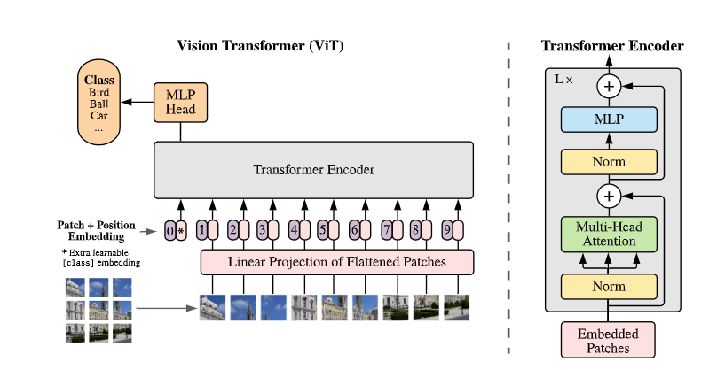
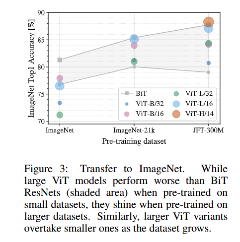
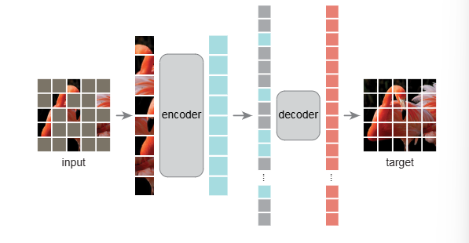
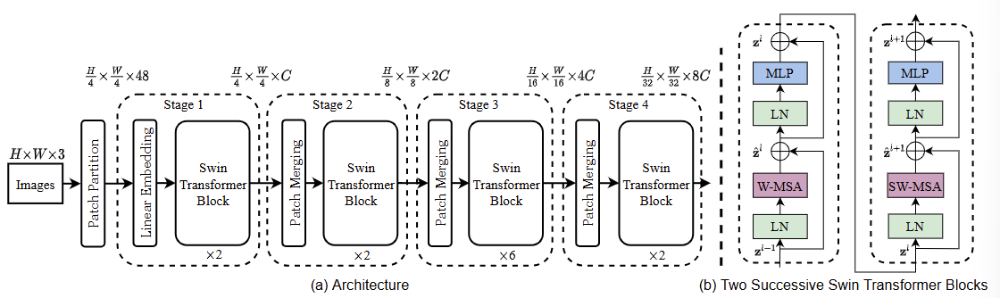
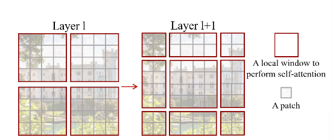
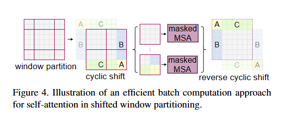
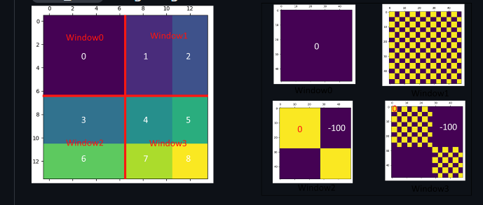
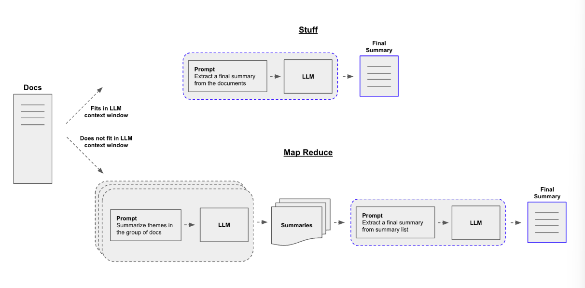

计划从这次总结开始，每周做一次论文阅读的总结，正好老师也要求写周报。这周计划读两个方面的文章，一个是补基础，读Vision Transformer相关的文章，读了三篇

- [Swin Transformer: Hierarchical Vision Transformer using Shifted Windows](https://arxiv.org/abs/2103.14030)

- [Masked Autoencoders Are Scalable Vision Learners](https://arxiv.org/abs/2111.06377)（MAE）

- [An Image is Worth 16x16 Words: Transformers for Image Recognition at Scale](https://arxiv.org/abs/2010.11929)（ViT）

另一个是读文本总结相关的文章，略读了两篇，

- [ChatGPT as a Factual Inconsistency Evaluator for Text Summarization](https://arxiv.org/abs/2303.15621)
- [Exploring the Limits of ChatGPT for Query or Aspect-based Text Summarization](https://arxiv.org/abs/2302.08081)

但是我发现应该是大模型出来以后，文本总结就开始围绕大模型进行研究了，主要研究大模型做文本总结的一些特性，例如幻觉等问题，关于文本总结自身，好像没有特别多的说法。

## [arXiv] An Image is Worth 16x16 Words: Transformers for Image Recognition at Scale



ViT论文的思路其实很简单，就是把Transformer尽量不做过多的改动，直接用到CV（特别是图像分类）的任务上来，值得注意的可能有几个技术和实验上的细节，

- Linear Projection Layer

一张图像首先会被切割成多个patch，每个patch会被输入一个全连接层，得到一个长度为D的向量（D是超参数）

- [class] token

ViT仿照BERT的做法，设置了cls特殊token，使用该token最后的输出作为分类的特征

- 主要实验结果



本文最主要的实验结果其实就是这张图，比较了不同大小的ViT和最好的ResNet之间在不同大小数据训练下的性能差距

## [CVPR] Masked Autoencoders Are Scalable Vision Learners



MAE的思路也很简单，主要有两个点，

- 找到了一个Vision Transformer比较适配的自监督任务，对Masked图像的重建（特别是Masked比率较高的图像），文章标题中的Autoencoders的Auto就是自监督的意思（我之前一直没有反应过来）
- 在这个自监督的框架下做了优化，让encoder只处理没masked的图像，使得encoder可以设计得比较大，而对应的，decoder就比较小

所以MAE在概念上其实类似于NLP中的BERT。

## [ICCV] Swin Transformer: Hierarchical Vision Transformer using Shifted Windows

如果说ViT对应Tranformer，MAE对应BERT，那Swin Transformer可能就对应于卷积神经网络了，它把卷积神经网络设计的经验用到了Transformer架构中来。



我们按照前向过程的顺序来讨论他的技术细节，

- Patch Partition，和前面两篇文章类似，image首先会被分为多个patch（HxWx3 -> H/4 x W/4 x 48）
- Linear Embeding，和前面两篇文章类似，作投影变换，把48变换为C
- Swin Transformer Block

Swin Transformer Block中包含了两种不同的注意力基础（W-MSA 固定窗口注意力和 SW-MSA 滑动窗口注意力），如下图所示，



固定窗口注意力就是把图像分为多个窗口，每个窗口包含多个Patch，每个Patch只与同一窗口的其他Patch做注意力。当然这样有个问题，就是不同窗口间没有交互，所以有了第二步的滑动窗口注意力，将窗口向右下平移，形成新的窗口，再做注意力，当然实际的实现和理论还是有些区别，为了使得窗口的大小一致，便于计算，实际的操作如下图所示，



新的窗口A C B被移动到了右下角，使得滑动后的窗口还是保持规整的大小，但是新移来的窗口，比如绿色的C，是不应该和同一窗口内的灰色部分做注意力的，本文作者通过巧妙的掩码设计解决了这一问题，



在QK相乘计算注意力时，为不应该交互的部分加上-100的掩码（在经过softmax函数后，实际接近0）

## [arXiv] Text Summarization 两篇

我在谷歌学术上，以Text Summarization为关键词搜索，按引用排序，找到了这两篇文章，但是这两篇文章好像没啥用，所以只做了个略读。

- ChatGPT as a Factual Inconsistency Evaluator for Text Summarization 

感觉上就是篇技术报告，使用ChatGPT评估文本总结的事实一致性，在蕴含推理（判断摘要与原文档是否一致），摘要排序，一致性评分等三个任务上做了实验。

- Exploring the Limits of ChatGPT for Query or Aspect-based Text Summarization

也是篇技术报告，在QMSum（会议记录）、SQuALITY（故事）、CovidET（Reddit帖子）和NEWTS（新闻）四个数据集上评估了ChatGPT的文本总结能力。

## LangChain框架

文本摘要的论文没看出东西来，就想着能不能先敲点什么代码，之前师兄提过LangChain，MetaGPT也是用LangChain写的，所以来学下这个框架，按照我对项目的理解，研究了两个demo，

#### 1）Summarize Text



LangChain的手册中讲，文本总结主要有三种方法，

- Stuff，直接做总结
- Map Reduce，要做总结的文本切块，分别做总结，然后把这一系列总结合在一起再做最后的总结
- Refine，迭代的做法，不断对总结做总结直到得到想要的结果

为了避免冗余，实例代码就不附在此处了

#### 2）Build an Extraction Chain

从非结构化数据中提取结构化数据，先设置提取策略，

```python
from typing import Optional
from langchain_core.pydantic_v1 import BaseModel, Field

class Person(BaseModel):
    """Information about a person."""
    name: Optional[str] = Field(default=None, description="The name of the person")
    hair_color: Optional[str] = Field(
        default=None, description="The color of the person's hair if known"
    )
    height_in_meters: Optional[str] = Field(
        default=None, description="Height measured in meters"
    )
```

然后构造Chain，

```python
prompt = ChatPromptTemplate.from_messages(
    [
        (
            "system",
            "You are an expert extraction algorithm. "
            "Only extract relevant information from the text. "
            "If you do not know the value of an attribute asked to extract, "
            "return null for the attribute's value.",
        ),
        ("human", "{text}"),
    ]
)
llm = ChatMistralAI(model="mistral-large-latest", temperature=0)
runnable = prompt | llm.with_structured_output(schema=Person)
runnable.invoke({"text": text})
```

LangChain的很多操作还是比较符合直觉的

## 参考

1. [Summarize Text | 🦜️🔗 LangChain](https://python.langchain.com/v0.2/docs/tutorials/summarization/)

2. [Build an Extraction Chain | 🦜️🔗 LangChain](https://python.langchain.com/v0.2/docs/tutorials/extraction/)
