2024年6月14日到6月21日，本周主要读了多模态QA相关的文章，包括

- [MultiModalQA: Complex Question Answering over Text, Tables and Images](https://arxiv.org/abs/2104.06039)（ICLR21）

- [WebQA: Multihop and Multimodal QA](https://arxiv.org/abs/2109.00590)（CVPR22）

- [MMCoQA: Conversational Question Answering over Text, Tables, and Images](https://aclanthology.org/2022.acl-long.290/)（ACL22）

- [MMToM-QA: Multimodal Theory of Mind Question Answering](https://arxiv.org/abs/2401.08743)（ACL24）

补基础论文读了一篇CLIP

- [Learning Transferable Visual Models From Natural Language Supervision](https://arxiv.org/abs/2103.00020)（ICML21）

## [ICLR21] MultiModalQA: Complex Question Answering over Text, Tables and Images

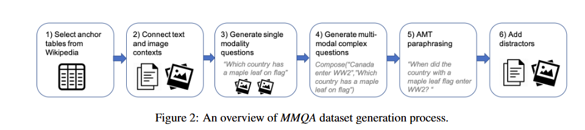

MultimodalQA，WebQA，MMCoQA这三篇文章在行文上都很类似，都没有过多的讲如何去做QA，而是把主要的篇幅放在了如何构造一个Multimodal QA的数据集上，在MMQA（MultiModalQA论文，简写为MMQA）中，构造MMQA数据集包含以下几步，

- **Wikipedia tables as anchors**，从维基百科的数据集中抽取表格数据作为开始
- **Connecting Images and Text to Tables**，将拥有相同实体的图片和文字与上一步抽取的表格联系起来
- **Generate single modality questions**，根据不同的模态，分别按照预先设计的模板（Table），众包人工生成（Image），在其他数据集的基础上让众包人工生成（Text）
- **Generating multimodal complex questions**，通过预先定义的Compose，Intersect和Compare操作生成多模态的复杂问题
- Paraphrasing using MAT，人工参与修改问题
- Add distractors，添加误导负例样本

总结起来其实就是，先获得相关联的表格，文本，图像数据，然后对每个模态的数据分别生成问题，并单模态问题合并，最后人工改述问题。

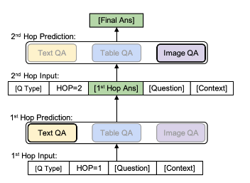

MMQA提出了Multi-Hop Implicit Decomposition（ImplicitDecomp）框架解决多模态问答问题，该框架有如下步骤，

- **问题分类**，MMQA数据集可以按TextQ、TableQ、Compose(TextQ, TableQ)等分为多个类型，该框架使用了一个BERT模型对问题进行分类
- **按分类迭代处理**，问题分类指明了该问题相关的模态，例如上图展示了一个关于图像和文本模态的问题的处理流程，其实就是先过TextQA模块（RoBERT模型），然后合并该模块的输出，再过ImageQA模块（VILBERT Vision-and-Language BERT模型）

## [CVPR22] WebQA: Multihop and Multimodal QA

与前面讲的MMQA一样，WebQA首先花了比较多的篇幅讲如何构造数据集，因为这篇文章是bing搜索发表的，所以获取数据的操作和搜索相关，他们默认annotators已经问了一个问题，构造数据集只需要在这个问题的基础基础上，获得答案和上下文

- Answers from Images

- Answers from Text

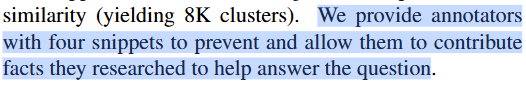

然后本文用一个章节讲述了自己的评价指标，主要有三个

- F1分数，和MMQA类似，本文的框架也要首先判断问题的类型，用F1分数衡量分类能力
- Fluency，本文通过BARTScore评价回答的流畅性，

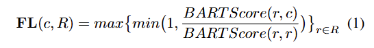

BARTScore(r, c)表示在给定参考r的情况下，生成候选c的可能性

- Accuracy，针对开放领域和非开放领域的问题，本文采取不同的公式计算准确度，

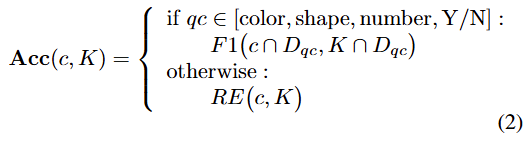

对于非开放领域问题，例如颜色，形状等，用F1分数判断是否回答正确，对于开放领域问题，用召回率RE评价准确度，其中K是模型给出的回答的关键词，c是标签

本文解决多模态QA的框架也分为两步，

- **Input Representation**，对于文本数据用Bert-base-cased tokenizer；对于图像数据，用目标检测模型（Faster RCNN）预测100个区域，然后把目标检测模型中间某一层的输出作为特征

- **Source Retrieval**，<[CLS], si, [SEP], Q, [SEP]>判断si是不是有用的上下文

- **Question Answering**，<[CLS], S, [SEP], Q,A, [SEP]>生成回答A

## [ACL22] MMCoQA: Conversational Question Answering over Text, Tables, and Images

和前面两篇文章一样，本文先讲了如何构建数据集，但是和前文不同的是，本文构造了一个对话QA的数据集，具体流程如下图所示，

本文是在MMQA的数据集基础上构造的自己的数据集，

- **Potential Conversation**，在MMQA中挑选具有相同实体的问题作为潜在对话
- **Decomposed Conversation**，按照MMQA中问题的分类对上一步挑选的问题进行分解，将问题分解为单模态问题
- **Refined Conversation**，人工调整

本文提出了一个Multimodal Conversational QA system with Adaptive Extractors（**MAE**）解决多模态对话QA问题，MAE主要有三个步骤，

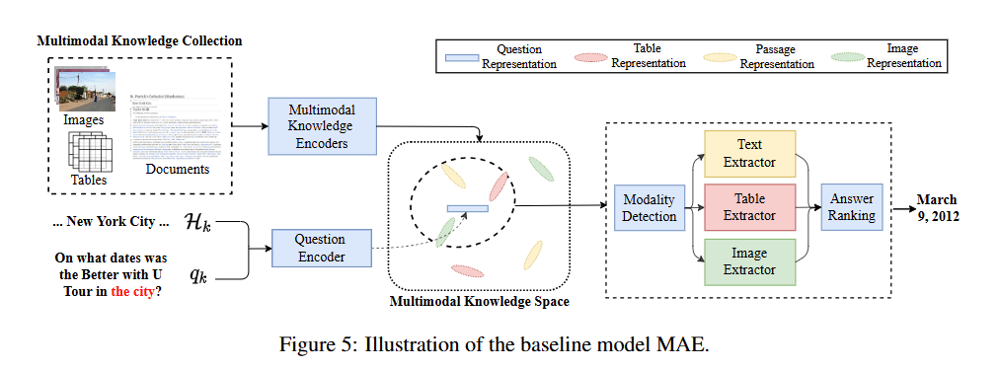

- **conversational question understanding**，对话历史和问题被BERT模型编码
- **multimodal evidence retrieval**，多模态的Knowledge同样分别别编码，然后按问题编码进行检索
- **adaptive answer extraction**，检索后得到多个模态的Knowledge，分别进行处理得到最后的答案

|        | Context | Multimodal               |
| ------ | ------- | ------------------------ |
| MMQA   | 无处理  | 迭代                     |
| WebQA  | 检索    | 图像encode后拼在一起输入 |
| MMCoQA | 检索    | 分别处理，最后拼接       |

## [ACL24] MMToM-QA: Multimodal Theory of Mind Question Answering

和前面三篇Multimodal QA的文章有些不同，本文聚焦一个更小的领域Theory of Mind，我理解就是人类行为相关的问答，文中举了下面这个例子，

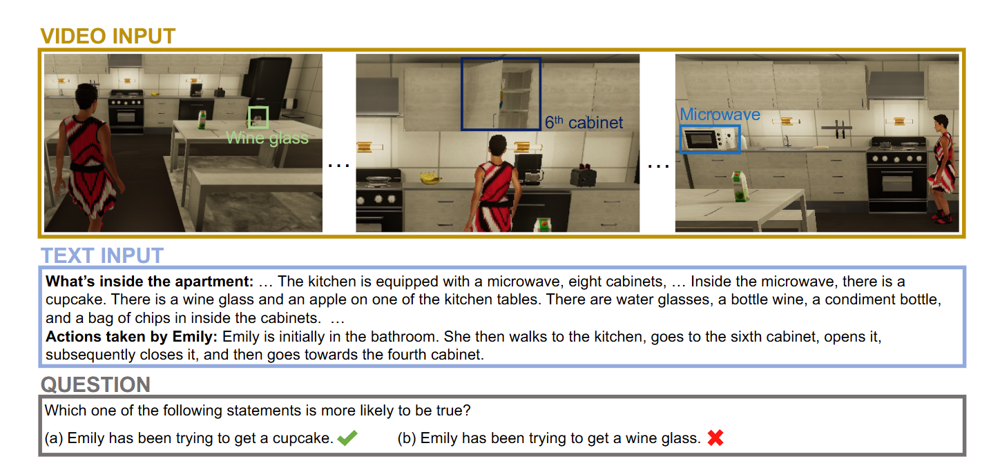

在有视频和文章说明的情况下，判断视频中人物可能的行为。和前三篇文章相同的是，本文也花一定的篇幅讲述了自己构建的数据集，但没有详细讲构建的方法（附录中应该有），只讲了自己数据集的分析，在它的数据集中包含了视频和文本的输入，以及对应的有两个选择的问题。本文数据集包含信念Belief和目标Goal两大类，共七小类的问题，如下图所示，

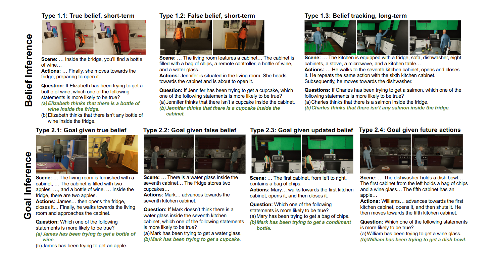

然后是本文的方法，Bayesian Inverse Planning Accelerated by Language Models（BIP-ALM），总体流程如下图，

- Unified Symbolic Representations，就是把视频、文本数据以及问题中的两个假设提取并对齐成上图所示的结果，得到了一系列的States和Actions
- Inverse Symbolic Planner

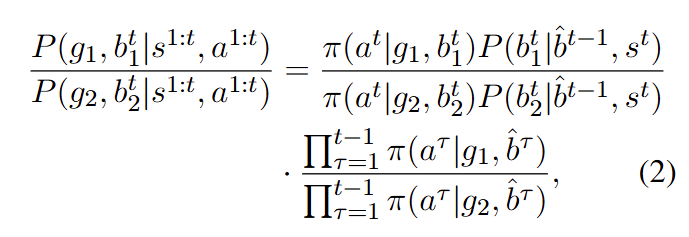

传统的方法都是用强化学习之类的方法计算上式，它这里用LLM计算，具体来说有如下步骤，

- 把每步的belief作为目标物体的可能位置
- 对LLM输入state st，goal g，估计的belief b和行为 at，计算该行为at的概率
- 遍历计算出上式，得到结果

## [ICML21] Learning Transferable Visual Models From Natural Language Supervision

CLIP的思路其实很简单，就是用对比学习目标来supervision一个image的encoder，具体内容其实就是下面两张图，本周主要还是看多模态QA，这个是上周末看的，所以只在这里做个简单的记录

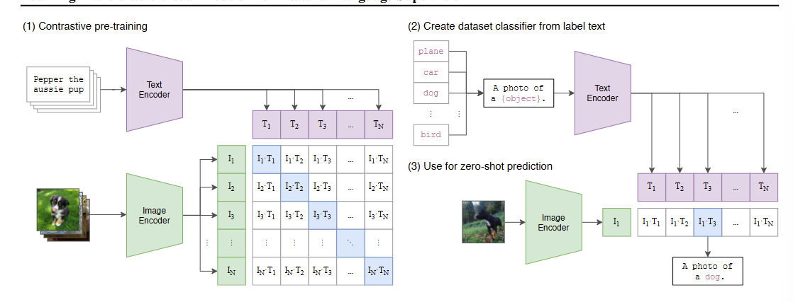

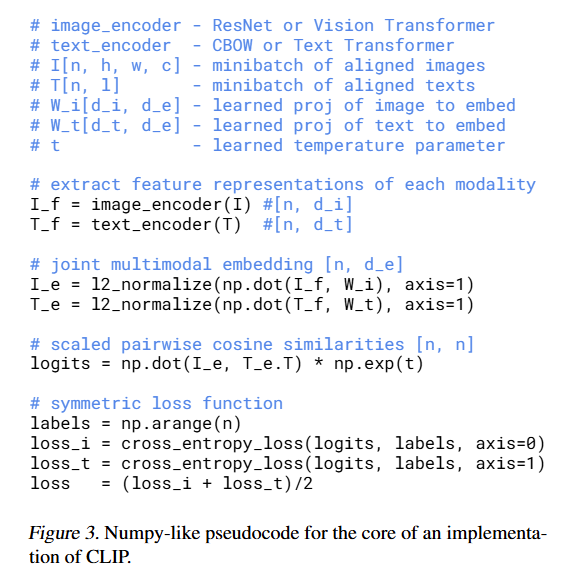
