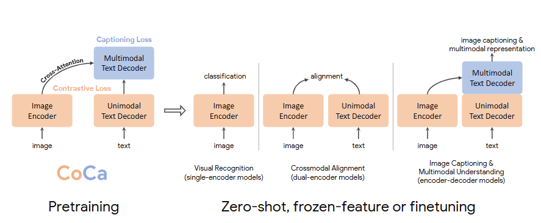
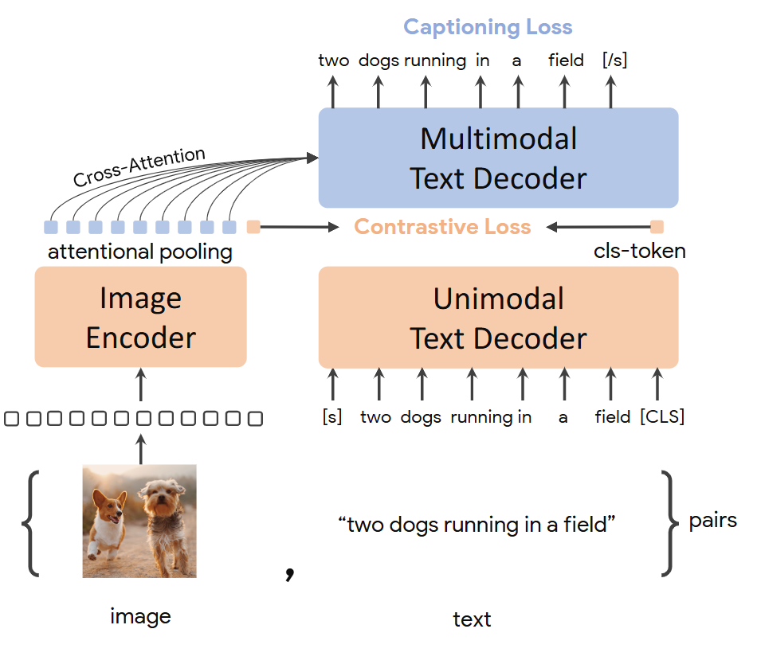
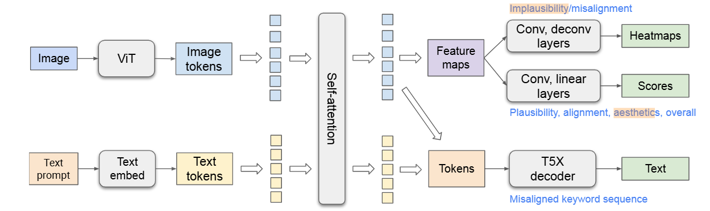
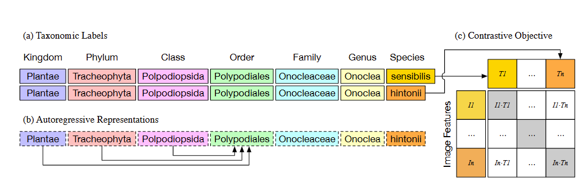
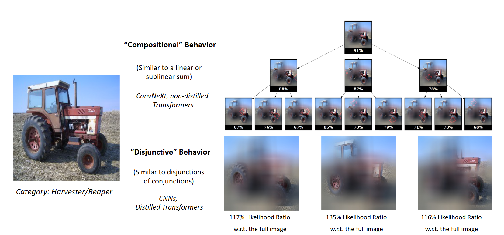
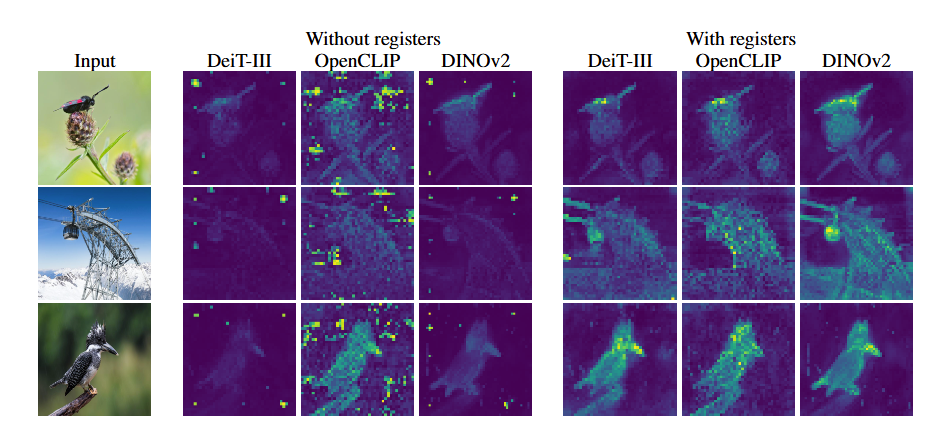
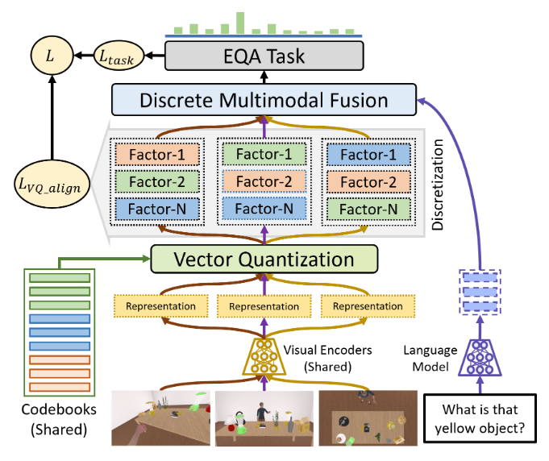

补的基础文章读的差不多，计划在开学前把各个顶会时间过一遍，确定下之后什么时候该关注什么论文，同时把最近一年的best paper有意思的读一遍，周末老师让看看图像分类和检索，看了下面这篇，

- [CoCa: Contrastive Captioners are Image-Text Foundation Models](https://paperswithcode.com/paper/coca-contrastive-captioners-are-image-text)（arxiv22 引用1013）

这次先读CVPR24的文章，**CVPR一年一次**，通常在每年**6月20日**左右举办，[CVPR 2024 Best Paper发布页](https://cvpr.thecvf.com/Conferences/2024/News/Awards)，计划读以下几篇文章，

- [Rich Human Feedback for Text-to-Image Generation](https://openaccess.thecvf.com/content/CVPR2024/papers/Liang_Rich_Human_Feedback_for_Text-to-Image_Generation_CVPR_2024_paper.pdf)（best paper），图生文
- [BioCLIP: A Vision Foundation Model for the Tree of Life](https://openaccess.thecvf.com/content/CVPR2024/papers/Stevens_BioCLIP_A_Vision_Foundation_Model_for_the_Tree_of_Life_CVPR_2024_paper.pdf)（best student paper），xxxCLIP
- [Comparing the Decision-Making Mechanisms by Transformers and CNNs via Explanation Methods](https://openaccess.thecvf.com/content/CVPR2024/papers/Jiang_Comparing_the_Decision-Making_Mechanisms_by_Transformers_and_CNNs_via_Explanation_CVPR_2024_paper.pdf)（honorable mentions），看标题有点意思

其他的best paper或者honorable mentions要不就不是AI，只有一篇[Image Processing GNN: Breaking Rigidity in Super-Resolution](https://openaccess.thecvf.com/content/CVPR2024/papers/Tian_Image_Processing_GNN_Breaking_Rigidity_in_Super-Resolution_CVPR_2024_paper.pdf); [Objects as Volumes: A Stochastic Geometry View of Opaque Solids](https://openaccess.thecvf.com/content/CVPR2024/papers/Miller_Objects_as_Volumes_A_Stochastic_Geometry_View_of_Opaque_Solids_CVPR_2024_paper.pdf)还和自然语言处理一点关系没有，所以都不读。

然后看ICLR24的文章，**ICLR也是一年一次**，一般每年**4月底5月初**开，[ICLR 2024 Outstanding Paper发布页](https://blog.iclr.cc/2024/05/06/iclr-2024-outstanding-paper-awards/)，计划读以下几篇，

- [Vision Transformers Need Registers](https://openreview.net/pdf?id=2dnO3LLiJ1)（outstanding paper），Vit

有了被BioCLIP骗的经历，我先过了一遍ICLR这几篇Paper的简介，发现要不就是对大模型做更改做分析，要不就是什么奇怪的领域的，所以只看了上面这一篇，之前老师让看多模态QA的文章，正好把今年ICLR和CVPR的QA的文章找来看了,

- [CABINET: Content Relevance-based Noise Reduction for Table Question Answering](https://openreview.net/pdf?id=SQrHpTllXa)（ICLR24）
- [EQA-MX: Embodied Question Answering using Multimodal Expression](https://openreview.net/pdf?id=7gUrYE50Rb)（ICLR24）

## [arXiv] CoCa: Contrastive Captioners are Image-Text Foundation Models

这篇文章其实很简单，就是把CLIP和传统的image captioning训练的方法结合了起来，如下图所示，

作者认为以前的模型可以分成三类，

- single-encoder models，一个图像的encoder，输出图像的编码结果
- dual-encoder models，一个image的encoder，一个test的encoder，通过对比学习损失训练（就是CLIP）
- encoder-decoder models，文本分支最后有个输出，通常是图像的captioning或者其他多模态的表征，通过对应的标注训练

本文作者就是把后两者的训练方式结合了起来，看一下下图其实应该就明白了，就是

- 中间图像特征和文本特征做一个对比学习损失
- 最后融合两个方面的特征输出captioning，做一个Caption损失

## [CVPR24] Rich Human Feedback for Text-to-Image Generation

顾名思义，就是RLHF（InstructGPT那篇文章）的Text to Image任务的版本，当然之前也有做类似工作的，本文的贡献主要在于他们收集了一个更rich的数据集，该数据集对每一张生成的图像包含了如下评价指标，

- 不可行的区域和与输入文本未对齐的区域
- 输入文本中未在图上表达的词
- 对生成图像模糊程度、对齐程度、艺术性和总体的评分

与数据集对应，本文设计了一个模型（RAHF，Rich Automatic Human Feedback）来自动生成上述评价，模型没什么好说的，如下图所示，比较常规，

## [CVPR24] BioCLIP: A Vision Foundation Model for the Tree of Life

只读了摘要、引言和结论部分，被名字骗了，以为Tree of Life是什么高大上的概念，结果其实就是篇生物学和计算视觉交叉方向的文章，对生物图片作细粒度的分类，好像工作量也挺大的，或许会对该领域有比较深的影响吧，但是对我来说不值得细读，简单总结一下，本文做了两个工作，

- 提出了一个数据集TREEOFLIFE-10M
- 构造了一个CLIP的框架，用细粒度的生物类别作文本端的输入

## [CVPR24] Comparing the Decision-Making Mechanisms by Transformers and CNNs via Explanation Methods

看名字比较有意思，所以找来读读，本文主要是提出了两个方法，

- subexplanation count

子解释计数要从Minimal Sufficient Explanations（MSE）开始讲起，MSE中的Explanation应该不是翻译为解释，我认为认为其实际的含义是图像中的patch，所以MSE其实就是图像的一组patchs，这组patchs在输入分类模型后可以取得和输入整张图像类似的分类概率（实践中是超过了某个阈值，例如0.9），同时这组patchs在删去任何一个patch后，都不能获得超过之前阈值的分类概率。

然后就是所谓的子解释计数，其实就是在MSE中逐步删去patch，选择删去后分类概率高于某个阈值（这里的阈值低于前面的MSE阈值）的组，最后通过在某个阈值设置下的所有子解释的数量。

- cross-testing

理解cross-testing要先知道deletion/insertion metrics，就是用一个模型生成输入图片的显著图，然后然后将显著图上最显著的部分逐步替换为基线图像（实践中就是原图的模糊版本），并计算替换后的分类概率得到的一个分数。

cross-testing就是用模型A的显著图在模型B上计算deletion/insertion mertics，以此判断两个模型关注的区域是否一致。其实我认为本文的重点是前半部分，也就是子解释的部分，后面这个cross-testing有点像为了补足工作量凑上去的。

在这两个方法的基础上，作者在实验中提出了两个概念，

- compositional，该模型做出分类决定依赖于多个组合的小patch，删去其中的任何一个最模型分类性能的影响不大
- disjunctive，模型实际只从很少的patch中提取信息做出分类决策

有了概念和方法，作者做了一系列的实验，得出了一些结论，

- CNN和Transformer相比，前者的MSE数量多，后者的MSE数量少，所以前者更disjunctive，后者更compositional，这很大程度上是因为BN和LN的不同，BN导致更低的compositional
- Cross-Testing部分的实验好像没啥用，就是讲那些模型和那些模型关注的区域比较类似之类，没提出需要关注的结论

## [ICLR24] Vision Transformers Need Registers

这篇文章故事讲了很长，但是最后构造的模型其实特简单，就是在正常的Transformer模型输入的序列的后面加了一些Register tokens，模型处理到最后又把这些tokens扔掉，如下图，

但是本文其实讲了一个挺有意思的故事，他们发现在Transformer模型处理流程中，讲其中几步的特征提取出来构成注意力图，图中会包含一些Artifacts（也就是outlier tokens），所谓outlier tokens就是与正常token值偏离较多的tokens，在下图中可以明显看出without registers中有一些异常tokens，

本文通过实验，确定了这些outlier tokens有如下特征，

- 只有大模型在大规模训练时才会出现
- 出现在背景区域，且周围多个patch包含了相似的信息
- 具有全局信息，不具有局部信息

然后作者就提出了前面说的方法来去除这些tokens，并通过实验证明这样对各种任务，特别是密集预测的任务有好处

## [ICLR24] CABINET: Content Relevance-based Noise Reduction for Table Question Answering

思路很简单，Table QA任务中生成答案的时候并不需要所有Table cell的数据，只需要关注少部分的sub table，其他不需要关注的部分就是噪音，会影响QA的质量，所有通过一个相关分数使得LLM更关注需要关注的sub table，模型总览图如下，

生成相关分数有两个步骤，

- Unsupervised Relevance Scorer，用了给模型作无监督的相关分数评分，这里的无监督实际上通过聚类损失实现，就是把表中的每个元素分为相关和不相关两类
- Relevent Cell Predictor，训练了一个模型来根据输入的问题和表格预测需要关注的部分，这里是有监督的训练，然后通过生成的预测打出相应的相关分数

两个部分的相关分数加起来，然后和QA LLM的输入作乘法，相当于对不同的tokens施加注意力

## [ICLR24] EQA-MX: Embodied Question Answering using Multimodal Expression

和之前读过的那片心智理论多模态QA类似，都是在一个更细的领域作多模态的QA，这篇文章是作的Embodied QA，我理解就是对与输入图片中人的行为相关（或者说与环境相关）的问题作回答（例如图片中有个人指向了西红柿，问：这个东西是什么，应该回答：西红柿），和之前看过的几篇多模态QA类似，本文也提出了数据集（EQA-MX），然后构造了框架处理EQA问题，模型总览图如下，

主要可以分为四个步骤，

- Visual Encoder和Language Encoder，用Vit和BERT之类的模型对图片和问题作编码
- Discretization，作者认为图片编码出的特征是连续的，不能直接和离散的文本特征融合，所以首先对图片特征做了离散化，其实就是预先学习了一个CodeBooks，在训练之后Codebook就固定住，后面测试的时候就通过图片的特征从这个CodeBooks里面找最相似的特征，作为离散的图片特征和文本特征拼在一起
- Discrete Multimodal Fusion，加权和，权重用了个全连接层学习
- EQA Task，对不同的任务训练不同的任务头
