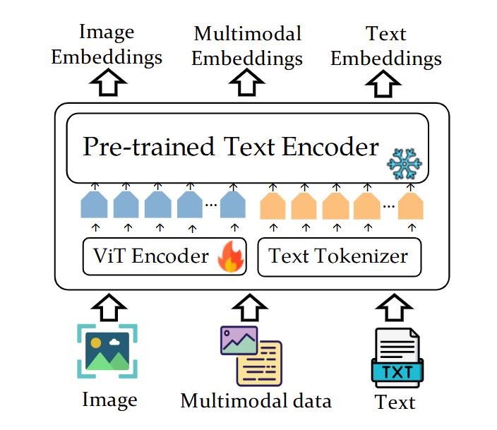
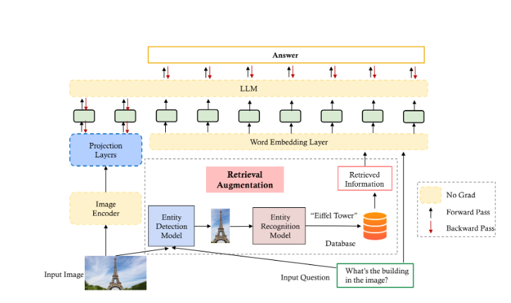

按照6月27号讨论时候说的，还是先从webQA，MMCoQA那几篇论文往后面找，找到这几篇，

- [VISTA: Visualized Text Embedding For Universal Multi-Modal Retrieval](https://arxiv.org/pdf/2406.04292v1)（arXiv 2406，引WebQA)
- [SnapNTell: Enhancing Entity-Centric Visual Question Answering with Retrieval Augmented Multimodal LLM](https://arxiv.org/pdf/2403.04735v1)（arXiv 2403，引WebQA）
- [MANYMODALQA: Modality Disambiguation and QA over Diverse Inputs](https://arxiv.org/pdf/2001.08034v1)（AAAI 20，三模态QA）
- [Unified Language Representation for Question Answering over Text, Tables, and Images](https://aclanthology.org/2023.findings-acl.292.pdf)（ACL findings 23，三模态QA）
- [Unifying Text, Tables, and Images for Multimodal Question Answering](https://aclanthology.org/2023.findings-emnlp.626/)（EMNLP findings 23，三模态QA）

然后看了之前讲的那篇知识图谱推理的文章，

- [Reasoning on Graphs: Faithful and Interpretable Large Language Model Reasoning](https://arxiv.org/abs/2310.01061)（ICLR 24）

## [arXiv 24] VISTA: Visualized Text Embedding For Universal Multi-Modal Retrieval

本文主要提出了三个东西，

- VISTA，针对多模态检索的一个数据文本嵌入模型

说起来其实很简单，就是图像用Vit处理得到编码表示，文本直接过一个Embedding，图里面写作Text Tokenizer

- 两个数据集（IT2I和T2IT）

Image&Text to Image（IT2I）数据集，生成方式如下图，

从一个原图像（Source Image&Text），用GPT和扩散模型生成相应的困难负例。然后是Text To Image&Text （T2IT）数据集，对ShareGPT4V数据集中的每一张图像的对应描述扩写成一段话T，并生成查询Q，然后图像，一段话和查询拼在一起作为数据集。

- 两段式的训练方法

显示Cross-Modal Training，用下面这个损失函数，

其中$L_{con}$表示对比损失，这个损失的目的是让Vit输出的$e_i$和Text Embedding $e_i$尽可能的接近，这段训练中用的数据集是Laion-2B。然后是Multi-Modal Training，用下面这个损失函数，

其中查询Q和待选C都是前面提出的两个数据集中的数据。

## [arXiv 24] SnapNTell: Enhancing Entity-Centric Visual Question Answering with Retrieval Augmented Multimodal LLM

和之前的多篇论文一样，提出了一个数据集SnapNTell，他在文中说自己是提出了一个SnapNTell任务，这个任务要求模型识别出图像的细粒度类别，并根据识别的类别生成深度理解的回答。然后提出了一个框架解决他提出的这个问题，数据集具体如下图，

框架结构如下图，

## [AAAI 20] MANYMODALQA: Modality Disambiguation and QA over Diverse Inputs

三模态QA（文本，图像和表格，和MMCoQA一样），和之前看的文章一样，提出了一个数据集MMQA，提出了一个方法解决这个数据集，数据集示例如下图，

和MMCoQA一样，或者说MMCoQA和这篇论文一样，都没没有融合处理三模态，而是先确定问题关于那一个模态，然后用处理该模态的模型回答问题，模型结构如下图，

## [ACL findings 23] Unified Language Representation for Question Answering over Text, Tables, and Images

思路很简单，就是把表格和图像都转成文本，然后三模态QA就变成了文本QA问题

具体有几个技术细节，都在上图中可以看到，

- Global和Local的文本caption生成
- 检索后先排序再把排序后的结果拼起来

## [EMNLP findings 23] Unifying Text, Tables, and Images for Multimodal Question Answering

和上文的思路完全一样，框架如下图所示，

唯一值得注意的是他有个Rationale Generator，是不是可以用知识图谱替代这部分，把三模态数据变成知识图谱，从知识图谱里面抓一条推理路径出来

## [ICLR 24] Reasoning on Graphs: Faithful and Interpretable Large Language Model Reasoning

本文提出了一个RoG（Reasoning on Graphs）的框架，如下图所示，

主要有两个方面的细节，

- Planning-Retrieval-Reasoning的过程
- 训练模型的损失函数

其中前者使得模型可以根据检索出的推理路径得到最后的答案，实际上就是语言模型损失，计算预测下一个词正确的概率。后者使得模型可以得到正确的关系路径，具体公式如下，

和语言模型的损失类似，只是这里下一个词变成了关系路径中的下一个实体。
