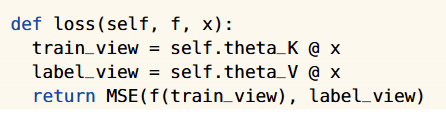

看了几篇知识图谱方向的文章，

- [CogMG: Collaborative Augmentation Between Large Language Model and Knowledge Graph](https://arxiv.org/abs/2406.17231)（arXiv 2406，知识图谱推理）
- [Knowledge Graphs Meet Multi-Modal Learning: A Comprehensive Survey](http://arxiv.org/abs/2402.05391)（arXiv 2402，综述）
- [Multimodal Reasoning with Multimodal Knowledge Graph](https://arxiv.org/abs/2406.02030)（arXiv 2406，多模态知识图谱QA）

然后看了TTT和LoRA，

- [Learning to (Learn at Test Time): RNNs with Expressive Hidden States](https://arxiv.org/abs/2407.04620)（arXiv 2407）
- [LoRA: Low-Rank Adaptation of Large Language Models](https://arxiv.org/abs/2106.09685)（arXiv 2106）

## [arXiv 24] CogMG: Collaborative Augmentation Between Large Language Model and Knowledge Graph

本文提出了一个统合LLM和KG的协作增强的框架，主要动机是作者认为之前的方法存在两个问题，

- Incomplete Knowledge Coverage
- Knowledge Update Misalignment

这个框架的步骤如上图所示，

- Question Decomposition，将用户的问题分解为多步
- Formal Query Generation，把上一步分解的结果生成对应的KG查询
- Querying KG，查询知识图谱，这是存在两种情况
  - 查到了，就拼上问题，输给LLM得到答案
  - 没查到，就用大模型生成没查到的部分（Knowledge Decomposition/Completion）
- Answer Integration，LLM生成答案
- RAG Verification，对于大模型补全的知识图谱，可以选择利用其他的数据库作RAG

本文给出了一个完整的例子，

## [arXiv 24] Learning to (Learn at Test Time): RNNs with Expressive Hidden States

总结起来本文其实就是把RNN中间的隐藏状态换成了一个可学习的模型，如下图所示，

当然中间存在很多技术细节，主要有三个方面，

- **Hidden states换成的模型如何训练（使用什么损失函数）**

一个典型的自监督损失，在具体的实现上，本文设置了两个可学习参数K，V对原始的x做映射，然后计算两者间的MSE

- **如何并行化（RNN的常见问题）**

具体来说作者做了两方面的设计，

- 一方面，作者不对权重做单步更新，做mini-batch的更新，即一个小batch b内的所有G1-Gb都直接从W0计算得到
- 另一方面，作者实际上不存储G和W（除了W0），而是从W0和输入的x直接计算输出的z

这部分参考以下两个公式，

- **与self-attention等价**

然后作者做了个证明，证明了TTT实际上等价于自注意力，证明很简单，就是把令上式的W0=0，zt实际上就变成了三个xs的乘，当然在实际中这三个x都是从原始的x乘一个不同的可学习参数变来的

最后作者做了些实验，证明这个TTT在各方面优于Transformer和Mamba

## [arXiv 21] LoRA: Low-Rank Adaptation of Large Language Models

本文的思路其实通过上面这一张简单的图就可以描述，对于Transformer架构的大模型，其中的可学习参数实际上主要都是一个一个的矩阵W，在学习的过程中，这些W通过$W+{\Delta} W$进行更新，作者根据之前的文章的结果假设$\Delta W$都是低秩矩阵，所以可以被分解为AB，其中AB是维度为dxr和rxk的矩阵，只要r远小于d和k，那学习A B实际上就比计算$\Delta W$简单很多。这样做有很多好处，

- 其一，很明显大大降低了需要更新的参数量，从全量微调直接更新W，变成了更新AB
- 其二，作者认为这样可以方便大模型在不同的下游任务上进行迁移，只需要固定之前预训练好的W不变，更新不同的AB即可
- 其三，主要和之前流行的adapter layer的思路相比，这样不会引入更多的推理延迟

## [arXiv 24] Knowledge Graphs Meet Multi-Modal Learning: A Comprehensive Survey

这篇综述有些长，其他地方我都是泛读，主要关注想要了解的几个问题，

- **多模态（主要是图片和文本）知识图谱如何表示？**

本文将多模态知识图谱分为了两类，

1. A-MMKG，将多模态数据作为知识图谱中实体的属性
2. N-MMKG，将多模态数据作为知识图谱中的实体

其中N-MMKG可以视为A-MMKG的一种变体，只要A中的实体也采取某种多模态数据。虽然分类写的有点啰嗦，但实际是和常识的，就是把多模态数据和文本一样作为知识图谱的节点

我在想应该还有一类就是将一张图片直接转为知识图谱，图片中的物体作为图中的节点，物体间的关系作为图中的边，当然这样一来这个知识图谱实际就不包含多模态数据了

然后作者讲了如何构建多模态知识图谱，主要分为两种方法

1. 提取图中的视觉实体，关系，时间构建知识图谱（和我前面的想法类似）
2. 从现有的知识图谱出发，将多模态数据直接联系到现有的知识图谱中

- **现在多模态知识图谱QA是如何做的？**

  

作者将知识图谱相关的理解和推理类的相关任务（QA是其中代表）划分为四个关键步骤，知识检索，知识表达，模态交互和回答确定，具体的方法看上图其实也比较明确，解释几个存在困惑的词，

1. Pruning，剪枝
2. Dense Retrieval，就是编码后在编码空间比较相似度
3. PLM Generation，PLM就是Pre-trained Language Model
4. Dynamic Memory Network，作者给了很官方的说法，根本看不懂，但看他并列的几个，肯定就是一种网络模型

- **其他**

我还关注了一下Caption生成，因为我发现多模态QA对多模态信息的利用很多时候就是直接生成Caption（其实是两类，还有类是编码后处理）

这个感觉有点用，我在想是不是可以不要生成的Caption，而是把他中间的知识图谱拿来做QA

## [arXiv 24] Multimodal Reasoning with Multimodal Knowledge Graph

本文提出了一个框架利用多模态知识图谱（MMKG）辅助大模型进行推理，主体架构如上图所示，主要有以几个方面值得注意，

- KG Encoder，作者在文中直接引了篇文章（RGAT，relation graph attention network），说自己就是用的这个模型做多模态知识图谱的编码，我计划后面有空读下这篇
- Knowledge/Visual Adapter，全连接层加交叉注意力（和Text的编码结果做交叉）
- 两个损失，一个语言模型，一个对比学习（也就上图中的Cross-Modal Alignment部分）

还有个地方值得注意，作者在引言中说，自己是第一个用MMKG来辅助LLM做多模态推理的

