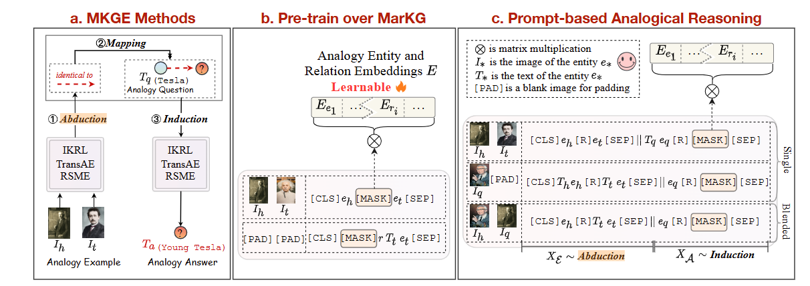
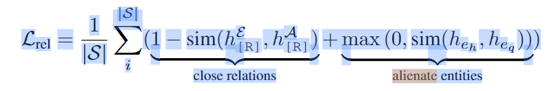
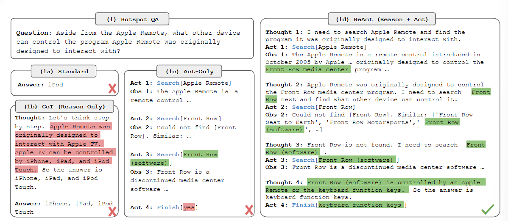
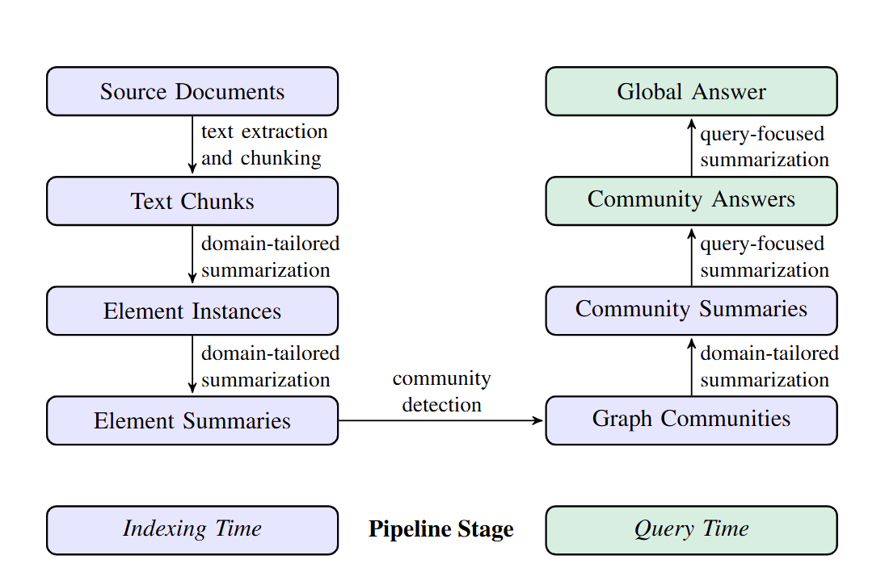

主要读CogMG的代码去了，附带着看了三篇论文，

- [Multimodal Analogical Reasoning over Knowledge Graphs ](https://github.com/zjunlp/MKG_Analogy)（MarKG数据集 ICLR 23）
- [ReAct: Synergizing Reasoning and Acting in Language Models](https://arxiv.org/abs/2210.03629)（arXiv 22）
- [From Local to Global: A Graph RAG Approach to Query-Focused Summarization](https://arxiv.org/abs/2404.16130)（arXiv 2404）

## [ICLR 23] Multimodal Analogical Reasoning over Knowledge Graphs

CogMG使用了这篇文章提出的数据集MarKG，这个数据集包含两个部分

- MarKG，一个多模态知识图谱，部分实体拥有图片属性，可能拥有多张图片
- MARS，一个类比推理的数据集，包含样例，问题和答案，示例如下

```json
{
    "example": ["Q14536140", "Q581459"], 
    "question": "Q50000", 
    "answer": "Q202875", 
    "relation": "P828", 
    "mode": 0
}
```

本文在方法部分做了两个方面的讨论，

- 总结了之前多模态类比推理的额base line的方法
  - MKGE Methods，先推理样例中两个实体的关系，然后搜索得到答案
  - MPT Methods，先用掩码的方法训练大模型，然后Prompt



- 本文提出了一个方法，主要在LLM的基础上做了两方面的改进

  - Adaptive Interaction Across Analogy，对于注意力机制的注意力分数做一个带参数的掩码，控制example tokens和question-answer tokens见的交互
  - Relation-Oriented Structure Mapping，类似于对比学习，一方面让example和answer的关系靠近，一方面让example和question的实体相互远离，公式如下

  

## [arXiv 22] ReAct: Synergizing Reasoning and Acting in Language Models

CogMG说用了ReAct的框架，我看了下这篇文章，思路很简单，就是Reasoning + Action，例如下图，



就是推理->行动->环境，如此循环。我看下实现，CogMG直接用的LangChain的实现，编写Tool函数和描述，让模型自己决定什么时候调用什么Tool。

## [arXiv 2404] From Local to Global: A Graph RAG Approach to Query-Focused Summarization

GraphRAG，把知识图谱分成多个Communities，然后集成多个Community的回答，框架如下图，



感觉计算量会比搜个子图出来，只参考子图做处理的方法大很多，我简单看了下文章的实验部分，好像没有找到关于计算量的分析
