看了ICML 24的几篇文章，

- [Unifying Image Processing as Visual Prompting Question Answering](https://arxiv.org/abs/2310.10513)（ICML 24）
- [Dissecting Multimodality in VideoQA Transformer Models by Impairing Modality Fusion](https://arxiv.org/abs/2306.08889)（ICML 24）
- （*）[KnowFormer: Revisiting Transformers for Knowledge Graph Reasoning ](https://openreview.net/forum?id=EncFNR3hxM)（ICML 24）

然后看了篇视觉大模型训练数据集制作的文章，

- [LAION-5B: An open large-scale dataset for training next generation image-text models](https://arxiv.org/abs/2210.08402)（NeurIPS 22）

看了几篇知识图谱QA/Completion的文章，

- [ChatKBQA: A Generate-then-Retrieve Framework for Knowledge Base Question Answering with Fine-tuned Large Language Models](https://arxiv.org/abs/2310.08975)（ACL 24）
- [KQA Pro: A Dataset with Explicit Compositional Programs for Complex Question Answering over Knowledge Base](https://aclanthology.org/2022.acl-long.422/)（ACL 22）
- [Do Pre-trained Models Benefit Knowledge Graph Completion? A Reliable Evaluation and a Reasonable Approach](https://aclanthology.org/2022.findings-acl.282/)（ACL-findings 22）

看了两篇大模型评估的文章，

- [ZhuJiu: A Multi-dimensional, Multi-faceted Chinese Benchmark for Large Language Models](https://aclanthology.org/2023.emnlp-demo.44.pdf)（EMNLP 23）
- [Chatbot Arena: An Open Platform for Evaluating LLMs by Human Preference](https://arxiv.org/abs/2403.04132)（arXiv 2403）

## [ICML 24] Unifying Image Processing as Visual Prompting Question Answering

这篇文章在技术上很简单，看下面两张图就能直接看明白，就是用one-shot QA的方式来做low-level的图像处理，用Mask的方式训练模型，

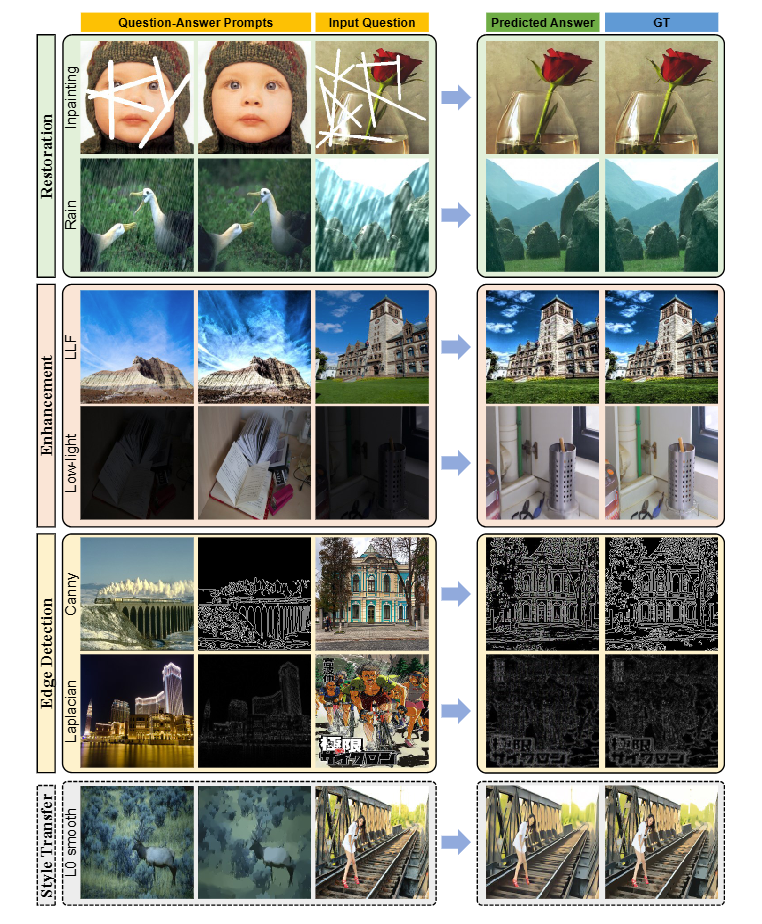

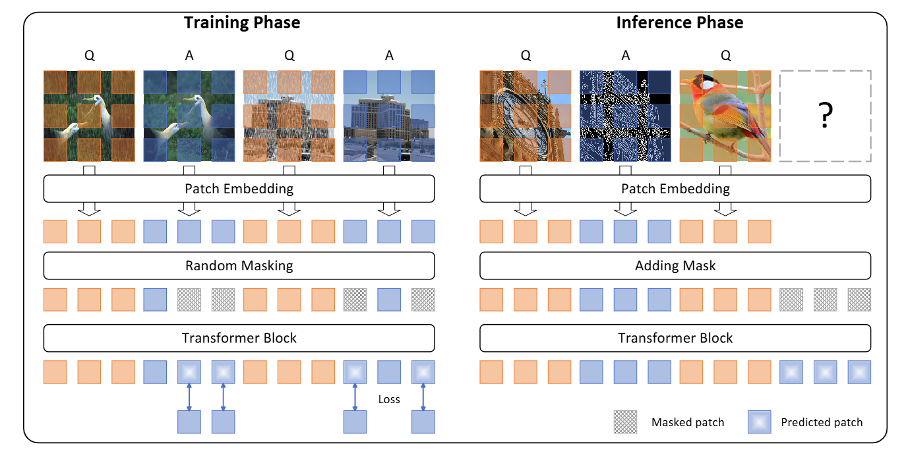

然后做了比较丰富的实验，证明了自己的方法在15个任务上取得了不错的结果，对比了自己的方法和之前的方法

## [ICML 24] Dissecting Multimodality in VideoQA Transformer Models by Impairing Modality Fusion

本文的动机来源于**之前的多模态的模型是否充分利用了两种模态的信息**这一问题，构建了QUAG（QUadrant AveraGe，象限平均）来证明并解决这一问题。对于注意力层的注意力矩阵有，

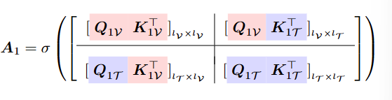

注意力矩阵和Value相乘有，

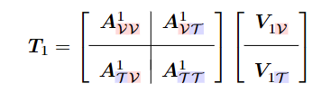

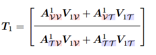

所以只要修改注意力矩阵的某些部分就能控制只利用某些模态的信息，本文使用了按行平均的修改方法，如下图，

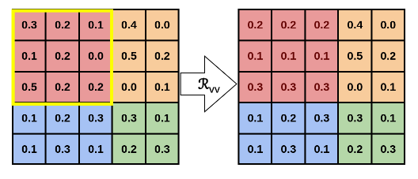

## [NeurIPS 22] LAION-5B: An open large-scale dataset for training next generation image-text models

本文提出了一个大规模的图片文字对的数据集，与当时其他数据集的比较如下图，

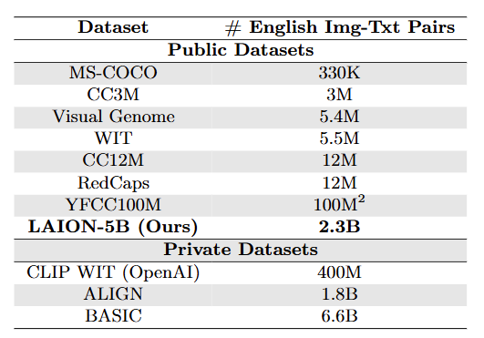

然后本文讲了以下它数据集的收集方法，大概分为以下三步，

- **Web page filtering**，在Common Crawl的页面中筛选有alt-text属性的img标签，并按语言种类给数据分类
- **Downloading Image-Text Pairs**，下载原始图片
- **Post-Processing**，删去有害的、过大过小的、冗余的数据，过滤文本图片相似度较低的数据

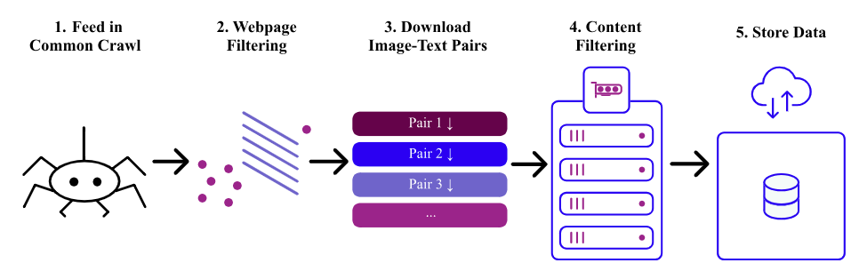

最后本文做了一串实验，证明自己的数据集有效，

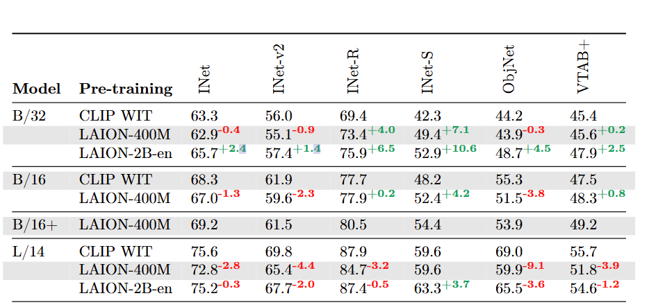

## [ICML 24] KnowFormer: Revisiting Transformers for Knowledge Graph Reasoning

本文提出了一个针对知识图谱推理的注意力机制，并使用该注意力机制构建了一个Transformer模型，总结本文之前需要补充一些背景知识，

- **Transductive（直推）和Inductive（归纳）任务**是知识图谱补全的两种任务，前者用已知的知识图谱信息（例如关系）补全未知的部分，后者需要补全的实体或关系在训练时是未知的
- **Knowledge Graph Reasoning和Completing**，就是一个东西，有的论文叫它推理，有的论文叫他补全，其实就是一回事

本文主要就是提出了一种新的注意力机制，其算法如下，

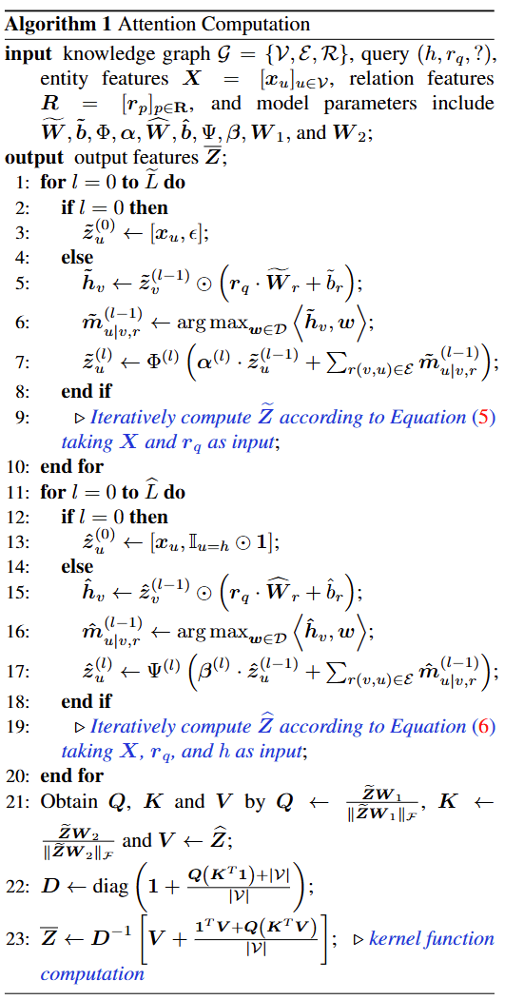

上图公式看着挺复杂，但其实要做的事情还是比较简单，如下图，

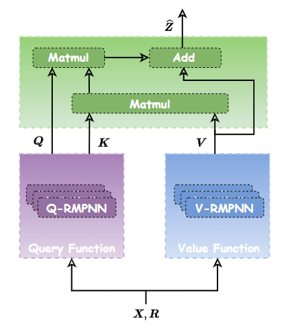

主要分为三个部分，

- **如何计算Query和Key**

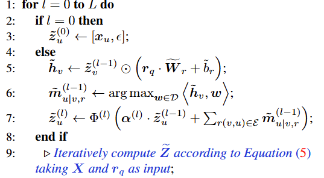

- **如何计算Value**

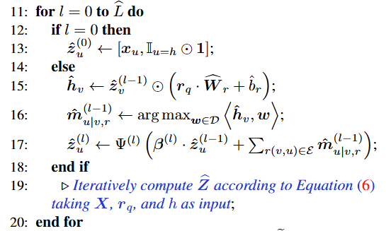

- **如何计算注意力矩阵**

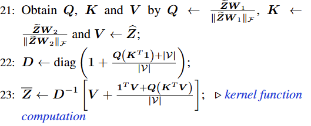

## [ACL 24] ChatKBQA: A Generate-then-Retrieve Framework for Knowledge Base Question Answering with Fine-tuned Large Language Models

本文实际解决的是类似知识图谱检索的问题，即给定一段文本，如何在知识图谱中检索到该文本相关的信息，本文给出的答案是生成-检索（Generate-then-Retrieve）框架，如下图，

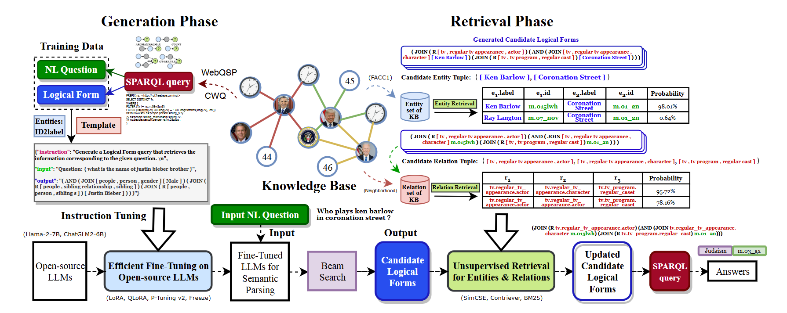

本文的方法可以分为以下几步，

- **LLM Fine-Tuning**

使用*question-SPARQL*对微调大模型，使大模型有能力针对输入的问题，输出对应的Logical Forms

- **Unsupervised Retrieval**

上一步得到的Logical Forms实际是非严格的SPARQL，其中的实体和关系都是不一定按本名直接存在于KB中，所以需要通过检索，将entity和relation换为KB中的准确描述

- **SPARQL query**

在上一步已经得到了正确的SPARQL查询语句，所以直接执行就能得到最后的答案

## [ACL 22] KQA Pro: A Dataset with Explicit Compositional Programs for Complex Question Answering over Knowledge Base

本文提出了两个东西，一个数据集KQA Pro，一个知识图谱查询语言/方法 KoPL（Knowledge-oriented Pro-gramming Language），首先是他的数据集，构建方法如下图，

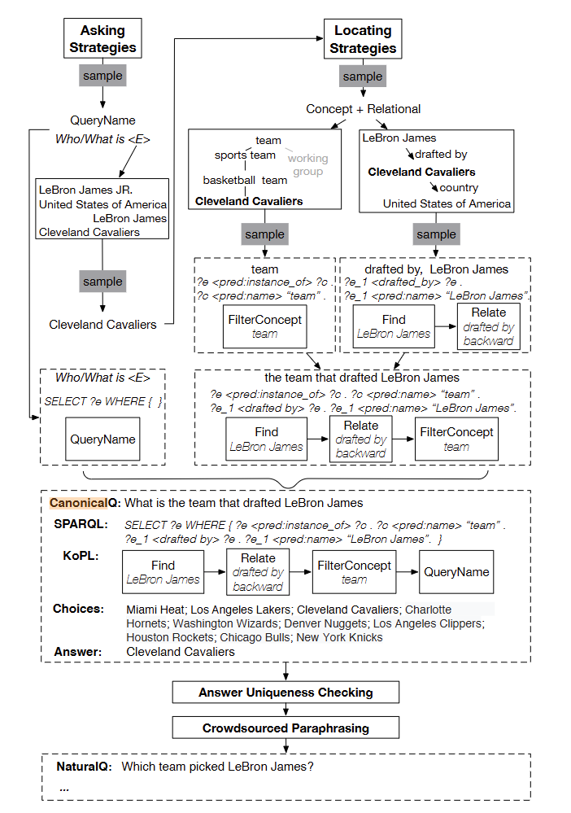

分为以下三步，

- 知识提取，提取了Wikidata的一个子图
- 问题生成，按模板生成（问题，SPARQL，KoPL，Choices，Answer）对
- 问题重写，雇人众包重写问题

然后是KoPL，这是一种描述如何查询知识图谱的语言，可以被表述成二叉树的格式，例如，

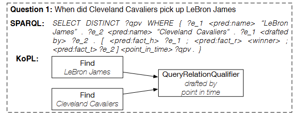

与SPARQL相比，KoPL提供了清晰的推理步骤，在中间出现错误的时候，人类可以快速的定位

## [ACL-findings 22] Do Pre-trained Models Benefit Knowledge Graph Completion? A Reliable Evaluation and a Reasonable Approach

和之前看到的很多QA的文章类似，本文提出了一个数据集和一个方法，首先是数据集，本文没有过多的介绍自己数据集的细节，而是着重描写了自的数据集和之前数据集的区别，

- 之前的数据集都是 Closed-world assumption (CWA)，在做link prediction任务的时候认为所有训练数据中的答案都是错误的
- 本提出的数据集是 Open-world assumption (OWA)，符合人类的认识，可以利用外部知识回答预测

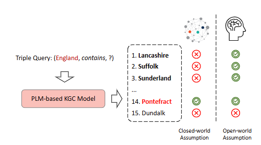

然后是本文提出的方法，主要就是用prompt模板来处理知识图谱的三元组，框架如下图，

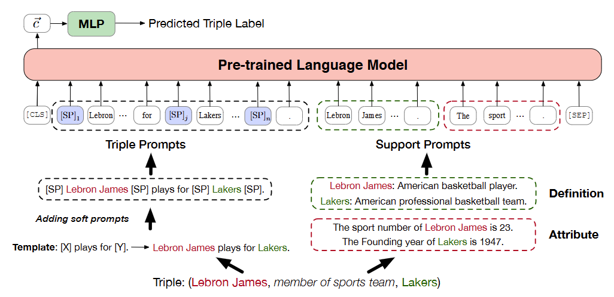

分为了两个部分，

- **Triple Prompts**

为每个关系构造了一个模板，例如

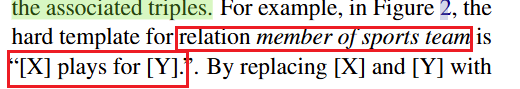

还使用了soft prompts技术，

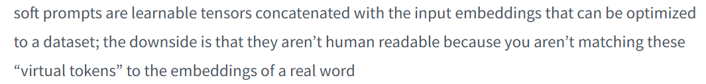

- **Support Prompts**

为每个属性构建了模板，例如上图中的Definition和Attribute

## [EMNLP 23] ZhuJiu: A Multi-dimensional, Multi-faceted Chinese Benchmark for Large Language Models

提出了一个大模型评估系统，包含三方面的内容，

**1）评估方法**

本文使用了三种评估方法，

- Metrics Evaluation，和常见的模型测试类似，就是测试大模型在某些数据集上某些指标的高低
- Scoring Evaluation，这个方法有点复杂，我理解就是用LLM生成数据然后评估其他模型，具体步骤如下，
  - 人工选取一些评估数据作为随机种子
  - 使用上一步的数据让ChatGPT生成进一步的评估prompts
  - 人工评估上一步生成的prompts，留下其中的100个
  - 让要评估的LLM执行这些prompts，让GPT辅助评分

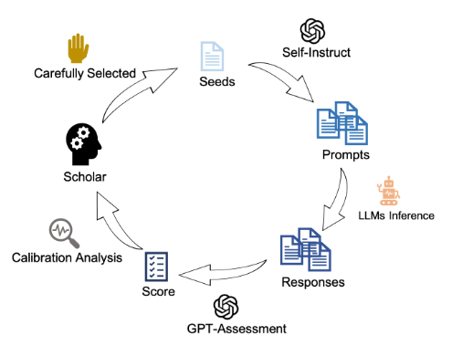

- Comparative Evaluation，Chatbot Arena式的方法，在不知道两个模型名字的情况下，人直接评价两个模型谁的回答更好

**2）数据集**

本文使用了两种数据集，

- Collect Datasets，就是之前的公开数据集
- Construct Datasets，就是上面讲Scoring Evaluation部分所述构造的数据

**3）评估维度**

本文从七个维度评估LLMs，评估方法和数据集如上述，详见论文2.3节

## [arXiv 24] Chatbot Arena: An Open Platform for Evaluating LLMs by Human Preference

本文基于自己[竞技场](https://chat.lmsys.org)快1年的数据收集结果，做了三个方面的贡献，

**1）数据集**

本文提出了一个来自90K人的240K投票结果的关于超过50个模型的数据集，涉及超过100种语言

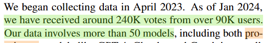

**2）Ranking方法**

本文使用了Bradley-Terry来对模型做排序，首先让用户对两个匿名模型作评价，得到一个模型对，以及该模型对中谁更好的评价结果，然后用BT算法对模型排序

**3）数据分析**

本文作了三个方面的数据分析，

- Topic Modeling，先给问题降维，然后聚类，得到600多个聚类簇
- Distinguish Models，不同模型擅长不同类型的问题

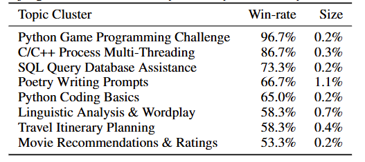

- Vote Quality，本文让自己学校的学生以及GPT也对模型作类似的比较，得到下表，证明了投票质量

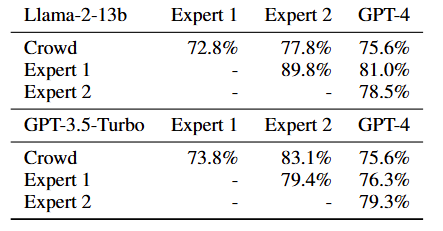
