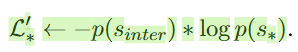
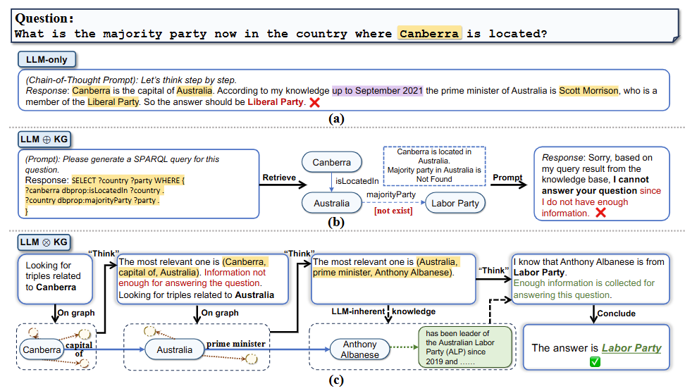

看了BGE的两篇论文，C-Pack和M3-Embedding，

- [M3-Embedding: Multi-Linguality, Multi-Functionality, Multi-Granularity Text Embeddings Through Self-Knowledge Distillation](https://aclanthology.org/2024.findings-acl.137.pdf)（ACL findings 24）
- [C-Pack: Packaged Resources To Advance General Chinese Embedding](https://arxiv.org/abs/2309.07597)（arXiv 2309）

然后看了两篇KGQA的文章，

- [FiDeLiS: Faithful Reasoning in Large Language Model for Knowledge Graph Question Answering](https://arxiv.org/abs/2405.13873)（arXiv 2405）

- [Think-on-Graph: Deep and Responsible Reasoning of Large Language Model on Knowledge Graph](https://arxiv.org/abs/2307.07697)（ICLR 24）

然后看了蚂蚁的KAG技术报告，

- [KAG: Boosting LLMs in Professional Domains via Knowledge Augmented Generation](https://arxiv.org/abs/2409.13731)（arXiv 2409）

## [ACL findings 24] M3-Embedding: Multi-Linguality, Multi-Functionality, Multi-Granularity Text Embeddings Through Self-Knowledge Distillation

#### 1）问题

之前的Embedding模型有三个问题，

- 多语言、跨语言能力弱
- 只针对某一种检索方式训练
- 支持的输入长度跨度不够大

所以本文提出了M3-Embedding，一个multi-linguality、multi-functionality and multi-granularity(n. 间隔尺寸)的模型

#### 2）方法

为了做到前面提到的三个能力，本文做了如下设计，

1. 使用大量多语言、跨语言数据集以获得多语言能力

2. 设计了self-knowledge distillation的训练框架以获得多功能能力，具体如下图

这里的多功能是指，

- Dense retrieval，就是query和passage编码，只使用[CLS] token计算相似度

- Lexical retrieval，每个token分别编码，计算query和passage重叠token的相似度和
- Multi-Vector retrieval，使用模型全部输出计算相似度和

主要的损失函数是典型的对比学习损失InfoNCE，

然后本文使用不同的s，得到知识蒸馏的指导标签，

然后构造了如下损失函数，

3. 设计了Efficient Batching来获得处理不同长度的输出的能力

这里其实很简单，就是先把输入文本按长度分类，然后分布式处理，每个GPU只处理相同长度的数据，如下图，

#### 3）实验

因为不做这个方向，所以没有特别关注实验部分，主体实验结果如下，

评价指标是nDCG（normalized Discounted Cumulative Gain，归一化折损累计增益），公式如下，

DCG的分母部分是为了给排序更靠前的输出更大的权重，IDCG就是DCG的理论最大值，用来做归一化，rel是第i个位置的输出（BGE实际是搜索算法，所以就是搜索得到的排序第i的结果）是否正确（@10，所以就是参考输出是否在搜索前十个输出内）

## [arXiv 2309] C-Pack: Packaged Resources To Advance General Chinese Embedding

### 1）问题

C-Pack解决的问题很简单也很直接，就是之前没有好的开源的中文Embeddings model相关的一系列东西，包括模型、数据集、评价方法和训练方法

### 2）方法

C-Pack主要包含四个部分，如下图，

- C-MTEB（Chinese Massive Text Embedding Benchmark）
- C-MTP（Chinese Massive Text Pair）

包含一个labeled子集和一个unlabeled子集

- BGE（BAAI General Embeddings）

BERT-like architecture

- Recipe（训练技巧）

三步，先是训练用的MAE的方法，掩码掉一部分数据做预测，然后是在C-MTP（unlabeled）子集上的对比学习，最后是在C-MTP（labeled）子集上的指令式微调

### 3）实验

主体实验结果如下表，

## [arXiv 2405] FiDeLiS: Faithful Reasoning in Large Language Model for Knowledge Graph Question Answering 

### 1）问题

KGQA的框架解决的问题其实大都是相似的逻辑，即

- LLM有幻觉 -> 需要外部知识，知识图谱是有结构的良好知识库，所以引入知识图谱

- KG的使用没有得到充分的探索 -> 本文提出EiDeLiS框架，解决了如下问题
  - 如何从知识图谱中检索
  - 如何利用知识图谱检索得到的知识

### 2）方法

本文方法的框架总览图如下，

可以分为以下几步，

- Path-RAG
  - 知识图谱中的所有实体和关系都embedding
  - question分解为关键字
  - 用keywords list检索相关节点和关系（按相似度评分），N表示i步的邻居

- DVBS（Deductive-Verification Guided Beam Search）

对上一步得到的候选Path用LLM做评判，用Beam Search的方法，每步取排序最高的k个下一步，得到最终的推理路径

### 3）实验

- 数据集：WebQSP、CWQ（用的RoG处理后的版本）和CR-LT-KGQA

- 主体实验结果如下，

## [ICLR 24] THINK-ON-GRAPH: DEEP AND RESPONSIBLE REASON-ING OF LARGE LANGUAGE MODEL ON KNOWLEDGEGRAPH

### 1）问题

之前的KGQA的方法大部分都是LLM+KG的方法，没有实现LLM和KG的深度交互，本文提出了LLM x KG的方法，示例如下，

### 2）方法

本文方法如下图，

可以分为如下几步，

- 提取问题的中心实体
- Relation Exploration
  - 在知识图谱中找到中心节点的相邻关系（Relation Search）
  - 在相邻关系中用LLM判断top-k（Relation Prune）
- Entity Exploration
  - 找上步的top-k关系的相邻实体（Entity Search）
  - LLM找tok-k实体（Entity Prune）
- 重复上述两步，由LLM判断是否得到充分信息回答问题
- LLM根据最终得到的Path推理

本文还有个Relation-based Think-on-Graph，就是最后得到的Path只有关系，不包含实体，实现和正常版本的ToG差不多

### 3）实验

- 数据集：CWQ、WebQSP、GrailQA、QALD10-en、Simple Question
  - 本文除了使用KGQA的数据集还用了
    - WebQuestions
    - 两个slot filling datasets：T-REx、Zero-Shot RE
    - fact-checking dataset：Creak
- 本文的主要实验结果如下

## [arXiv 2409] KAG: Boosting LLMs in Professional Domains via Knowledge Augmented Generation

> 本文是一篇技术报告，而不是正常的论文，所以这里不按问题、方法、实验进行记录，而是重点关注本文的几个技术重点

本文提出了KAG（Knowledge Augmented Generation）框架，如下图，

大致可以分为三个部分，

- KAG-Builder，从原始的Documents开始，构建一个知识图谱
  - LLMFriSPG（LLM Friednly Semantic-Enhanced Programmable Graph）
  - Mutual Index，原始文本的chunks也作为知识图谱的实体
  - Knowledge Alignment，利用外部知识和Concept Graph做知识对齐
- KAG-Solver，基于KAG-Builder构建的知识图谱，使用大模型进行问答
  - Logical Form Solver，将检索和推理动作用逻辑格式语言定义
- KAG-Model，本文的很多操作是利用LLM完成的，所以他们提出了训练微调LLM的流程

### 1）KAG-Builder：知识图谱的构建

不同于典型的KGQA任务，知识图谱由测试数据集直接给定，本文实际解决的是KBQA任务，需要参考的知识以文档格式存在，所以第一步需要将Documents变成Knowledge Graph，执行流程如下，

#### 1.1 LLM Frendly Knowledge Representation（LLMFriSPG）

本文在SPG的基础上提出了一种大模型友好的知识图谱构建范式（LLMFriSPG），对于该范式下的知识图谱包含以下几部分，

- T表示EntityType，EventType和预定义的属性
- ρ表示instance和concepts之间的关系
- C表示ConceptType
- L表示可以执行的操作

以下面的知识图谱为例，

对于T下面的每一个实体t，都有

这里包含三类该实体的关系和属性，

- $p^c$ ：static，pre-defined
- $p^f$ ：dynamic，ad-hoc
- $p^b$ ：内置属性（summary，desciption，supporting_chunks，belongTo）

然后本文给构建好的知识图谱中的知识做了分层，如下图，

将知识图谱中的数据分为了三类，

- $KG_{cs}$：经过了总结、融合和评估的领域知识
- $KG_{fr}$：OpenIE提取出的节点、关系、概念
- RC（Raw Chunks）

#### 1.2 Mutual Indexing：知识图谱和Chunks的互索引

其实就是Chunks也作为知识图谱中的Entity

#### 1.3 Knowledge Alignment

这里技术细节有点多，具体记录如下，

- Domain Knowledge Injection And Constraints，领域知识注入
  - 存储该领域的主要concepts和term在KG中
  - 从documents中提取instance（IE），vector retrieval相关的concetps和term
  - 根据上一步得到的相关concepts和term再做IE

- Schema-constraint Extraction（范式约束的提取）和Pre-defined文档知识结构
  - 不同领域的document有不同的格式，政府报告有主管部门、服务程序、需要材料等

- Enhance Indexing
  - Disambiguation and fusion of knowledg instances
  - Predict relation between instances and concepts
  - Complete concepts and relations between concepts

### 2）KAG-Solver：基于知识图谱的问答框架

本文有一个基于知识图谱的问答框架，如下图，

也是比较常见的planning-reasoning-generation的框架，具体分为以下三步，

- Planning：将问题分解为多个子问题，每个子问题对应一个Logical Form
- Reasoning and Retrieval：根据子问题的Logical Form执行操作，回答子问题
- Generation：判断是否能回答最初的问题，不能就回到Planning步骤，提出补充计划

#### 2.1 Logical Form

这里本文主要的点应该是Logical Form，其实类似于之前ReAct的Action或者ToolGPT的Tool的概念，就是一些给LLM的工具，有不同的具体执行方法，本文给了5个Function，如下表，

和之前的ReAct或者ToolGPT不同可能在于本文的逻辑格式，类似于KGQA中语义解析的方法，将自然语言转换为程序语言，然后按特定的程序执行

### 3）KAG-Model

前面提到的很多操作都需要LLM来完成，如下图，

所以本文提出了一套针对性的训练方法，然后训了几个模型，主要是将LLM需要的能力分为了三块，

- NLU（Understanding），和正常的LLM训练差不多
- NLI（Inference）
  - 构造了一个有8000个concepts和他们语义关系的数据集
  - 在6中不同的推理指令下作训练
- NLG（Generation）
  - triples-to-text generation task
  - 受到RLHF启发，用KG反馈作强化学习，评分是大模型输出匹配到KG中三元组或者实体的个数

然后本文提出虽然有这么多步骤，但是应该使用同一个大模型来降低不同模型间传递的消耗，其他任务都还好，主要有一个embedding任务输出不太一样，所以本文专门设置了一个retrieval tokens（类似BERT的[CLS] token）

### 4）实验

本文主体实验结果如下表，

