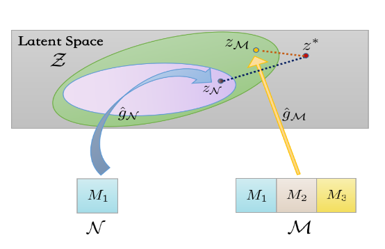
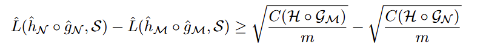

看了篇Multi-Agent的论文Chatlaw，

- [Chatlaw: A Multi-Agent Collaborative Legal Assistant with Knowledge Graph Enhanced Mixture-of-Experts Large Language Model](https://arxiv.org/pdf/2306.16092)（arXiv 2306）

看了篇多模态学习理论的论文，

- [What Makes Multi-modal Learning Better than Single (Provably)](https://arxiv.org/abs/2106.04538)（NeurIPS 21）

## [arXiv 2306] Chatlaw: A Multi-Agent Collaborative Legal Assistant with Knowledge Graph Enhanced Mixture-of-Experts Large Language Model

> 这篇的github有6k的stars，但是实际没有开源？我看issur也没人复现成果，感觉是买的stars......

#### 1）问题

本文解决的问题也是老生常谈的hallucination

#### 2）方法

本文提出了一个数据集，一个模型，一个框架，其中数据集因为是法律领域，和我的方向不同，这里不做记录，主要来看看模型和框架，如下图，

首先是Misture-of-Experts LLM，本文具体的模型细节讲的很少，可能要后面看了代码才能弄懂这个MoE LLM的细节，根据本文的描述，我理解这个模型就是之前常见的多模型混合中的一种方法，同时又多个LLM，然后选几个LLM出来投票（结果相加）

然后是Multi-Agent Collaborative Framework，就是一个多智体框架，分为四步，

- 根据问题检索知识图谱
- 根据知识图谱检索数据库
- 根据数据检索案例
- 根据案例生成结果

## [NeurIPS 21] What Makes Multi-modal Learning Better than Single (Provably)

#### 1）问题

本文解决的问题很直接，就是如题所示，为什么多模态学习比单模态好，作者从两个方面回答了这个问题，

- （When）什么时候多模态学习优于单模态学习
- （Why）什么导致了多模态学习优于单模态学习

#### 2）方法

本文的方法部分可以分成两块，首先作者抽象了一个多模态学习的框架以备后面的学习证明，如下图，

作者把多模态学习分为两步，首先从不同模态编码数据X编码到同一个隐藏空间Z，然后从隐藏空间Z映射到任务空间Y，这两个映射过程分别通过函数族G和H完成。

然后作者做了两个证明，

- **隐藏空间质量影响模型表现**

作者首先定义了隐藏空间质量，如下式，

这了的r(·)，就是模型输出和参考值的损失。然后作者利用Rademacher complexity measure得到了下面的不等式，

这个式子的右边是M个模态学习结果和N个模态学习结果的差值，左边可以分为两块，后面三项是模型复杂度的衡量，前面rS是M个模态和N个模态隐藏空间质量的差值，模型复杂度的部分可以简化为O(sqrt(1/m))，所以这里其实就证明了模型表现受限于隐藏空间质量。

- **数据量影响隐藏空间质量**

这个式子也可以分为两个部分，前面三项是模型复杂度，后面的L可以理解为模型表现，然后作者做了一些替换，

最后作者把N个模态的不等式和M个模态的不等式相减，得到要M个模态的隐藏空间质量大于N个模态的隐藏空间质量，需要满足，

其实就是m足够大，也就是数据量足够多，多模态训练的隐藏空间就会比单一模态的好

- **线性模型的例子**

然后作者具体分析了线性模型的例子，主要是证明了M个模态的隐藏空间质量一定优于N个模态的隐藏空间质量，

然后把这个带入隐藏空间质量的计算中

#### 3）实验

本文的实验部分倒是很简单，作者找了个情感分类的数据集，有文本、视频和音频三个模态然后分析了不同模态的结果，

作者还做了个有意思的实验，他合成了几个数据，

然后分析了数据重叠对多模态学习的影响，

