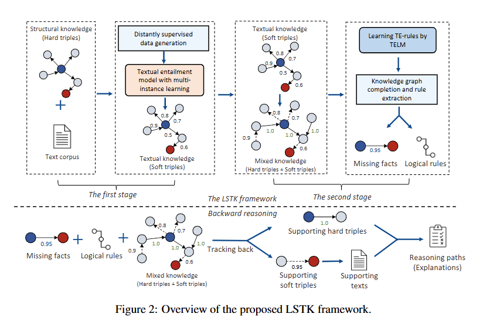
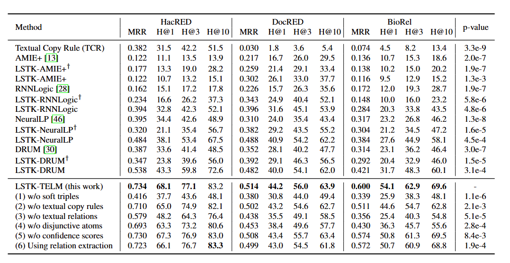
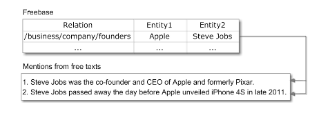
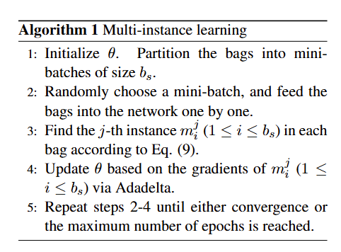
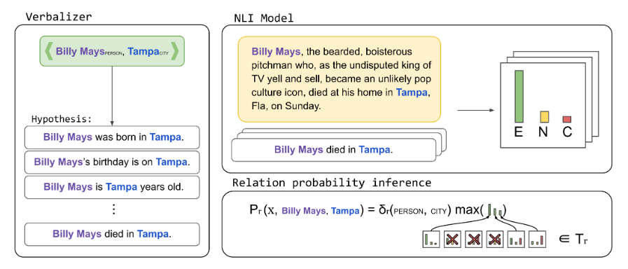
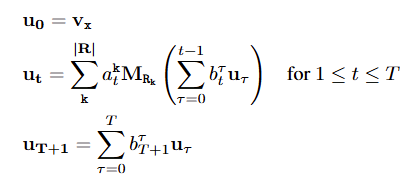

11月7号做分享，所以顺着一篇知识图谱补全的文章（LSTK），往前读了相关的几篇知识图谱的文章，包括关系抽取和Logical Rules的知识图谱补全，

- [Learning from Both Structural and Textual Knowledge for Inductive Knowledge Graph Completion](https://proceedings.neurips.cc/paper_files/paper/2023/hash/544242770e8333875325d013328b2079-Abstract-Conference.html)（NeurIPS 23）
- [Distant supervision for relation extraction without labeled data](https://aclanthology.org/P09-1113/)（ACL 09）
- [Distant Supervision for Relation Extraction via Piecewise Convolutional Neural Networks](https://aclanthology.org/D15-1203/)（EMNLP 15）
- [Label Verbalization and Entailment for Effective Zero and Few-Shot Relation Extraction](https://aclanthology.org/2021.emnlp-main.92/)（EMNLP 21)
- [Differentiable Learning of Logical Rules for Knowledge Base Reasoning](https://arxiv.org/abs/1702.08367)（NeurIPS 17）

## [NeurIPS 23] Learning from Both Structural and Textual Knowledge for Inductive Knowledge Graph Completion

#### 1）问题

本文研究的问题是Inductive Knowledge Graph Completion，我发现Knowledge Graph Completion、Knowlegde Base Reasoning和Knowledge Graph Reasoning这几个任务在大部分时候都是类似的意思，只是严格来说Completion可以分为Inductive和NoInductive，前者在补全的过程中会遇到训练集中不存在的entity，也就是需要所谓的Reasoning，现在的测试集应该都是这一类，所以现在KGC、KGR和KBR实际就是一个东西。

本文指出之前的KGC方法只利用结构知识，可能会丢失有用信息（所有加模态的论文中最扯的一类解释）

#### 2）方法

本文的方法说起来其实很简单，就是两个阶段，

- First Stage：将文本数据转换为软三元组

本阶段的目标就是把数据集中的文本数据转换Soft triples，所以其实是个关系抽取任务，本文也是按关系抽取任务的思路来完成的，具体涉及了之前三篇论文的方法（会在下面介绍），先利用Distant Supervision的假设获得大量标注数据，也就是训练集，

这里的训练集每组数据包含三个部分，三元组，三元组对应的文本（根据distant supervision假设得到），标签y（就是0和1，表示句子能否突出三元组，作者通过更改三元组关系从正例中得到负例）。然后利用该训练集微调一个BERT做文本蕴含任务，输入"[CLS]<triple>[SEP]<sentence>[SEP]"，然后通过输出的CLS token计算蕴含概率，这里还用到了multi-instance learning来缓解distant supervision假设带来的噪声。最后就得到了一个模型可以判断某个三元组能否从某个句子中推出，将这个模型用于测试集就能完成将文本数据转换为软三元组的任务。

- Second Stage：从软硬三元组中计算出Logical Rules

本文第二个阶段的任务是从上阶段得到的soft triples和知识图谱原有的hard triples中计算得到Logical Rules，这个计算通过学习模型完成，利用机器学习的参数表示某个逻辑规则是否成立，然后学习该参数。具体公式如下，

#### 3）实验

- 数据集：HacRED2、DocRED3和BioRel4 （应该是关系抽取常用的数据集，因为本文需要用到text数据，而一般的KGC数据集不会自带text数据）
- 指标：MRR和Hit@n
- 主要结果：

可能是Logical Rules领域的问题，这里甚至还有17年的方法（NeuralLP）

## [ACL 09] Distant supervision for relation extraction without labeled data

#### 1）问题

本文研究的问题其实很直观，训练关系抽取的模态无监督的方法效果不够好，有监督的方法数据不够多，所以本提出了一种半监督的方法，自动得到大量标注数据。

#### 2）方法

本文虽然花了大量的篇幅讲了如何对一个句子做特征的提取，然后训练一个分类器以区分某句子中两实体间的关系，但是我们现在其实没必要关注他如何做特征的处理和他计算的过程，本文方法部分最终要的其实就是distant supervision假设，

任何一对已知三元组的两个实体，如果出现在某句子中，则该句子表达的实体间关系就是该三元组的关系。

## [EMNLP 15] Distant Supervision for Relation Extraction via Piecewise Convolutional Neural Networks

#### 1）问题

本文解决的问题其实是跟着Distant supervision（也就是上一篇文章）来的，上篇文章提出的假设其实有点扯，因为一个句子就算有和三元组相同的两个实体，它表达的关系也不一定和三元组一样。所以本文利用多实例学习（multi-instance learning）解决这个问题（多实例学习可以追溯到更久之前，不是本文提出的，但是本文是第一个用多实例学习解决distant supervision问题的，有比较大的影响力）

#### 2）方法

所谓多实例学习，其实也很直观，既然每种关系标签下可能有标错的数据，那我就把同种关系的数据分为多个mini-batch，然后每个mini-batch下我只去分类为该关系概率最高的那条数据做为训练数据，其他数据就丢掉，具体算法如下，

## [EMNLP 21] Label Verbalization and Entailment for Effective Zero- and Few-Shot Relation Extraction

#### 1）问题

这是篇更近的文章或者说大模型时代的文章，所以本文解决的问题其实是如何用大模型做zero-shot的关系抽取，因为大模型在文本蕴含任务上做了比较多的训练，所以本文提出把关系抽取任务转换为文本蕴含任务来做，以充分利用大模型的能力。

#### 2）方法

本文的方法也很直接，具体如下图，

可以分为两个阶段，

- Verbalizer

关系抽取任务其实先要从句子中识别出两个实体，图中省略了这一步，直接得到了两个实体，然后就两个实体间可能的关系生成一句话。

- NLI Model

上一步得到了(entity pair, Hypothesis, Sentence)的数据对，这一步就调用文本蕴含的模型来判断hypothesis能否从句子中推出，也就是hypothesis是否蕴含在sentence中。

## [NeurIPS 17] Differentiable Learning of Logical Rules for Knowledge Base Reasoning

前面几篇文章都是LSTK在第一阶段中完成关系抽取任务参考的方法，而本文就是LSTK第二阶段的主要参考

#### 1）问题

本文的问题很直接，Logical Rules如何通过可学习的模型建模

#### 2）方法

所谓的Logical Rules其实就形如下式，

如果箭头右边的关系成立，则可以推出箭头左边的关系。本文首先介绍了TensorLog的标记，将Logical Rules表示为下式，

其中$\alpha$表示某条规则是否成立，$\beta$表示规则，M是某个关系的矩阵（如果实体i和实体j存在关系Rk，则该矩阵的i,j 位置上为1），然后假设我们有标记好的数据，就可以计算下面的分数，

最后的目标就是使得score尽可能的大，所以有，

但是这里有个问题，因为上式中需要学习的参数都是离散的，所以不能直接通过梯度下降来构造一个学习模型，所以本文都上式做了修改，得到了一个循环计算公式，

这里的a、b在形式上对应于上文中的$\alpha$和$\beta$，分别表示了关系注意力和对之前计算步骤的注意力，是连续可学习的参数。
