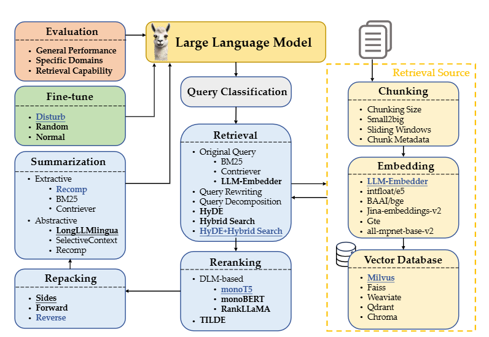
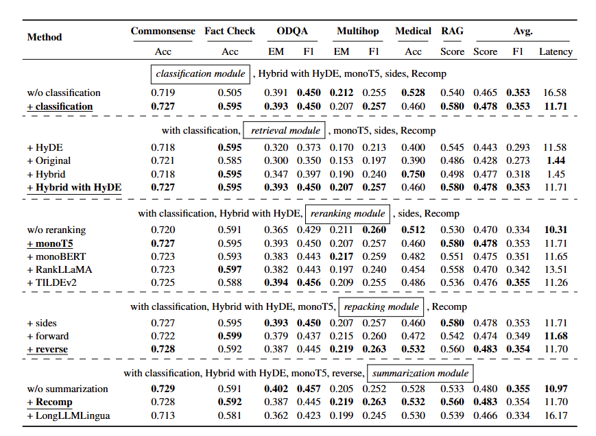
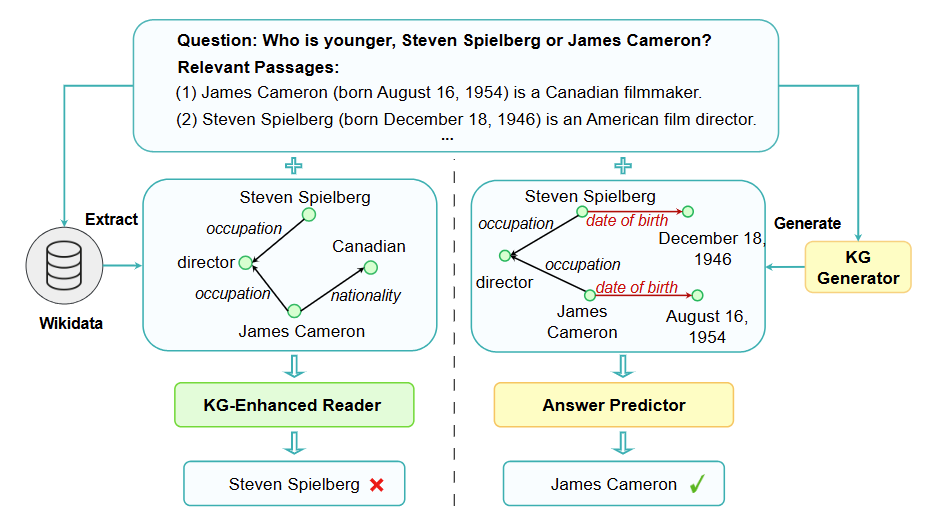
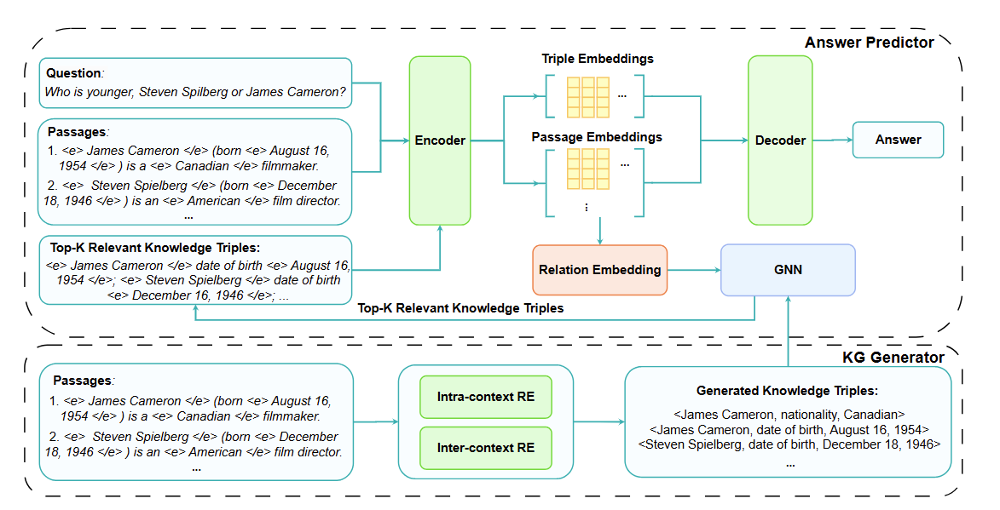
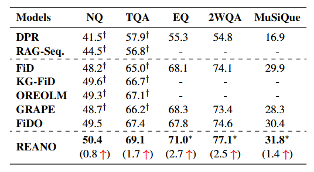

先看了老师发我的RAG最佳实践的论文，

- [Searching for Best Practices in Retrieval-Augmented Generation](https://aclanthology.org/2024.emnlp-main.981/)（EMNLP 24）

然后看了几篇知识图谱+RAG的论文，

- [REANO: Optimising Retrieval-Augmented Reader Models through Knowledge Graph Generation](https://aclanthology.org/2024.acl-long.115/)（ACL 24）
- [TRACE the Evidence: Constructing Knowledge-Grounded Reasoning Chains for Retrieval-Augmented Generation](https://aclanthology.org/2024.findings-emnlp.496/)（EMNLP 24）

## [EMNLP 24] Searching for Best Practices in Retrieval-Augmented Generation

#### 1）问题

如题所示，就是找到RAG的最佳实践。本文还在discussion的部分讨论了一点多模态，但是感觉有点画蛇添足，虽然我能get到他想讲检索图然后回答比直接生成的好处。

#### 2）方法

作者把RAG的流程分为了上图所示的步骤，

- Retrieval Source（黄色）

对要检索资料的处理，可以分为chunking，embedding和vector databse三大块

- Retrieval（蓝色）

从资料中检索出query相关文档，然后排序，打包和总结处理

- Fine-tune（绿色）

微调大模型以使之更好利用检索回来的数据

- Evaluation（红色）

大模型评估

#### 3）实验

本文最后得到了RAG最佳实践的结论，实验结果如下图，

## [ACL 24] REANO: Optimising Retrieval-Augmented Reader Models through Knowledge Graph Generation

#### 1）问题

本文的逻辑是这样的，

- Open domain question answering任务需要外部数据（他没提幻觉，然后将使用外部数据归因于任务本身）
- 外部数据的passages之间的关系被之前的方法忽视 -> 使用KG利用passages之间的关系
- 之前的方法直接使用现存的知识图谱，存在incompleteness -> 从检索的passages生成知识图谱

有一点点问题是第二和第三条间好像不关联，但是问题不大。本文还给了个图例，

#### 2）方法

本文的方法可以分为两个阶段，

- KG Generator

从passages生成知识图谱（本文假设相关的passages已经获得），其实就是关系抽取任务，本文也直接使用了最近的关系抽取方法，只是分了intra-context（一篇passage内做关系抽取）和inter-context（所有passage间作关系抽取，这里其实就是实体识别后查wikidata）

- Answer Predictor

在得到passages生成的KG后，本文先用了个GNN来找到最相关的K个三元组，然后把这K个三元组和在一起作为新的passage和原来的passages一起作最后答案的生成。

他这里答案生成用的是Fusion-in-Decoder的模型，就是就是每篇passage和问题拼在一起编码，然后所有passage的编码结果拼在一起解码出最后的答案

#### 3）实验

- 数据集：Natural Questions (NQ), TriviaQA (TQA), EntityQuestions (EQ), 2WikiMultiHopQA (2WQA)和MuSiQue
- 评价指标：Exact Match (EM)，预测的答案是否能匹配到任何参考答案
- 实验结果：

## [EMNLP 24] TRACE the Evidence: Constructing Knowledge-Grounded Reasoning Chains for Retrieval-Augmented Generation
