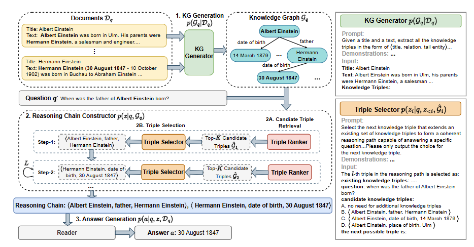

先看了老师发我的RAG最佳实践的论文，

- [Searching for Best Practices in Retrieval-Augmented Generation](https://aclanthology.org/2024.emnlp-main.981/)（EMNLP 24）

然后看了两篇知识图谱+RAG的论文，

- [REANO: Optimising Retrieval-Augmented Reader Models through Knowledge Graph Generation](https://aclanthology.org/2024.acl-long.115/)（ACL 24）
- [TRACE the Evidence: Constructing Knowledge-Grounded Reasoning Chains for Retrieval-Augmented Generation](https://aclanthology.org/2024.findings-emnlp.496/)（EMNLP findings 24）

然后看了两篇多模态关系抽取（Multimodal Relation Extraction）的两篇文章，

- [Multimodal Relation Extraction with Efficient Graph Alignment](https://njuhugn.github.io/paper/Multimodal Relation Extraction with Efficient Graph Alignment-Zheng-mm21.pdf)（MM 21）
- [Multimodal Relation Extraction with Cross-Modal Retrieval and Synthesis](https://aclanthology.org/2023.acl-short.27/)（ACL 23）

## [EMNLP 24] Searching for Best Practices in Retrieval-Augmented Generation

#### 1）问题

如题所示，就是找到RAG的最佳实践。本文还在discussion的部分讨论了一点多模态，但是感觉有点画蛇添足，虽然我能get到他想讲检索图然后回答比直接生成的好处。

#### 2）方法

作者把RAG的流程分为了上图所示的步骤，

- Retrieval Source（黄色）

对要检索资料的处理，可以分为chunking，embedding和vector databse三大块

- Retrieval（蓝色）

从资料中检索出query相关文档，然后排序，打包和总结处理

- Fine-tune（绿色）

微调大模型以使之更好利用检索回来的数据

- Evaluation（红色）

大模型评估

#### 3）实验

本文最后得到了RAG最佳实践的结论，实验结果如下图，

## [ACL 24] REANO: Optimising Retrieval-Augmented Reader Models through Knowledge Graph Generation

#### 1）问题

本文的逻辑是这样的，

- Open domain question answering任务需要外部数据（他没提幻觉，然后将使用外部数据归因于任务本身）
- 外部数据的passages之间的关系被之前的方法忽视 -> 使用KG利用passages之间的关系
- 之前的方法直接使用现存的知识图谱，存在incompleteness -> 从检索的passages生成知识图谱

有一点点问题是第二和第三条间好像不关联，但是问题不大。本文还给了个图例，

#### 2）方法

本文的方法可以分为两个阶段，

- KG Generator

从passages生成知识图谱（本文假设相关的passages已经获得），其实就是关系抽取任务，本文也直接使用了最近的关系抽取方法，只是分了intra-context（一篇passage内做关系抽取）和inter-context（所有passage间作关系抽取，这里其实就是实体识别后查wikidata）

- Answer Predictor

在得到passages生成的KG后，本文先用了个GNN来找到最相关的K个三元组，然后把这K个三元组和在一起作为新的passage和原来的passages一起作最后答案的生成。

他这里答案生成用的是Fusion-in-Decoder的模型，就是就是每篇passage和问题拼在一起编码，然后所有passage的编码结果拼在一起解码出最后的答案

#### 3）实验

- 数据集：Natural Questions (NQ), TriviaQA (TQA), EntityQuestions (EQ), 2WikiMultiHopQA (2WQA)和MuSiQue
- 评价指标：Exact Match (EM)，预测的答案是否能匹配到任何参考答案
- 实验结果：

## [EMNLP 24] TRACE the Evidence: Constructing Knowledge-Grounded Reasoning Chains for Retrieval-Augmented Generation

#### 1）问题

本文虽然也和上面这篇做法是几乎一致的，都是将相关文档转为知识图谱，然后利用知识图谱生成回答，但是对于为什么要转为知识图谱的理由不一样，

- 上文的理由是：利用知识图谱提取passage间的关系
- 本文的理由是：利用知识图谱提取更相关的信息

#### 2）方法

本文的方法很简单，和上文的框架基本一致，看上图也能看明白，所以这里不赘述

#### 3）实验

本文的实验有点取巧了，它实际没有在各个数据集上达到sota的结果，但是它只比了对文档的不同处理方式，如下图，

而没有正经的和其他方法做比较

## [MM 21] Multimodal Relation Extraction with Efficient Graph Alignment

#### 1）问题

本文应该是Multimodal Relation Extraction的第一篇文章，也提出了一个数据集。本文提出MRE任务是为了利用image补全noisy social media texts的lack of contexts，具体来说本文举了个例子，

- sentence：JFK and Obama at Harvard.

对于这个句子可以识别出JFK和Obama两个实体（我其实有点疑问为啥没Harvard实体），但是不知道两者间的关系，而实际这个句子隐含的关系应该是两者是校友（Alumni），如果有两者一起穿学士服的照片，这个关系比较好提取

#### 2）方法

本文的方法如下图，

这个图其实思路很清晰，具体有三步，

- 信息提取
  - 语义信息，就是encode、embedding，只是image是先做目标识别，然后分块做编码
  - 结构信息，图像好理解，目标识别然后场景图生成，文本这里用了dependency-based的方法，如下图，

- Multimodal 对齐

上一步分别得到了语义特征和结构特征，这一步对这两种特征分别做图片和文本的对齐。语义的图片文本对齐就是注意力机制；结构的对齐主要利用了节点的度作为结构特征。

- 特征融合和关系预测

就是上图最右边的融合操作，最后做个MLP的分类

#### 3）实验

主要实验结果如下图，

## [ACL 23] Multimodal Relation Extraction with Cross-Modal Retrieval and Synthesis

#### 1）问题

和上面这篇文章处理的是同样的任务（MRE），但是思路不一样，这篇文章有点RAG的感觉

#### 2）方法

文本编码、图像编码，然后模态融合，没啥好说的。这里值得注意的是，本文利用输入的文本和图像做了检索（用的Google的API），获得了图像相关的实体信息，以及更多的图像信息，然后把检索到的知识一样做了encode。

#### 3）实验

主要实验结果如下图，

