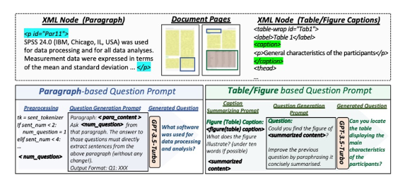
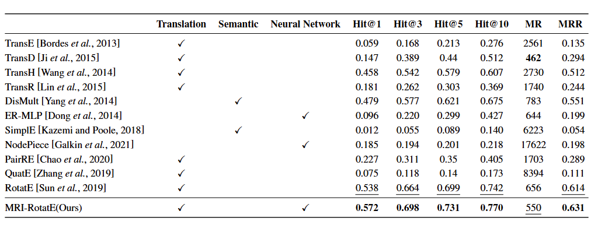

看了IJCAI 24的几篇KGQA和多模态QA的文章，

- [KG-CoT: Chain-of-Thought Prompting of Large Language Models over Knowledge Graphs for Knowledge-Aware Question Answering](https://www.ijcai.org/proceedings/2024/734)（IJCAI 24）
- [MMVQA: A Comprehensive Dataset for Investigating Multipage Multimodal Information Retrieval in PDF-based Visual Question Answering](https://www.ijcai.org/proceedings/2024/690)（IJCAI 24）
- [Enhancing Multimodal Knowledge Graph Representation Learning through Triple Contrastive Learning ](https://www.ijcai.org/proceedings/2024/659)（IJCAI 24）

然后看了彭博社提出的金融LLM，

- [BloombergGPT: A Large Language Model for Finance](https://arxiv.org/abs/2303.17564)（arXiv 2303）

## [IJCAI 24] KG-CoT: Chain-of-Thought Prompting of Large Language Models over Knowledge Graphs for Knowledge-Aware Question Answering

#### 1）问题

我一开始以为这篇文章没在KGQA的数据集上做，结果被题目骗了，这就是篇KGQA的文章，所以它的思路和其他KGQA的思路是一样的，

- LLM特定知识缺乏，幻觉 （Lack of Responsible Factual Knowledge）
- Cognition Gap with Knowledge Retrievers（query -> knowledge通过相似度，但是相似度不保证有用）

#### 2）方法

如上图所示，本文可以分为三步（两步）

- Graph Reasoning

作者训了个小的Graph Reasoning model，具体其实就如上图所示

- Reasoning Path Generation

就是根据前一步的知识图谱推理模型生成推理路径

- Joint Reasoning

把推理路径和问题拼一起问LLM答案

#### 3）实验

- 数据集：WebQSP、CWQ、SimpleQuestions、WebQuestions
- 实验结果：

- 它在实验中还有一个有意思的点是说他很便宜

## [IJCAI 24]  MMVQA: A Comprehensive Dataset for Investigating Multipage Multimodal Information Retrieval in PDF-based Visual Question Answering

#### 1）问题

本文主要提出了一个DQA（Document QA）的数据集，这个数据集和之前的数据集主要的不同是它需要multipage的推理

#### 2）方法

本文数据集的生成很简单，如下图，

- 首先从PubMed收集一些pdf和xml格式的document
- 然后调chatgpt，分别对parageraph和table/figure格式的问题做生成

然后本文提出了DIR（Document Information Retrieval）任务，即输入问题和相关实体，输出问题的目标实体，如下图，

最后本文提出了几个解决该问题的benchmark方法

- Multimodal Multi-Page Retriever框架
- RoI-Based Frameworks
- Image Patch-Based Frameworks
- Joint-Grained Retriever

#### 3）实验

主要实验结果如下图，

## [arXiv 2303] BloombergGPT: A Large Language Model for Finance

读了下这篇论文，感觉虽然工作量很大，但是实际上都是工程性的东西，收集了大量的数据，然后训了个很大的模型，这里主要记录一下在阅读论文时对Tokenizer的问题，回顾一下通用的Token方法

| Method    | Model              |
| --------- | ------------------ |
| BPE       | GPT-1/2/3，ChatGLM |
| WordPiece | BERT               |
| Unigram   | T5、BloombergGPT   |

#### 1）分词

所谓Tokenizer，其实就是将输入的句子进行切分的操作，根据切分粒度可以分为，

- 基于词的切分
- 基于字的切分
- 基于subword的切分

其中基于subword的切分是目前的主流形式，其实就是高频词依旧是完成的词、低频词会变成有意义的子词，例如dogs会变成[dog,##s]

#### 2）切分流程

通常如下图所示分为4步，

- Normalization：去除停用词，多余的空格，大小写等
- Pre-tokenization：不同tokenizer的实现不一样，通常就是直接基于空格和标点切分
- Postprocessor：添加特殊Token等

#### 3）Byte-Pair Encoding（BPE）

BPE的思路其实很简单，在训练阶段，

- 首先将所有训练数据按字母分词，形成初始词表（helllo -> h, e, l, l, l, o）
- 然后按词表2gram统计pair的词频（he 1, el 1, ll 2, lo 1）

- 然后将频率最高的pair合并为一个词添加到词表中（词表：h, e, l, o, ll）
- 重复前一步直到词表大小到达设置的结果

在推理阶段，也是将数据切分为字符，然后按训练阶段得到的词表作最长匹配

#### 4）WordPiece

WordPiece和BPE的思路基本一致，只是不是选择频率最高的pair，而是按下面的公式计算互信息，

这里的a和b是计划合并的词表中的两个词，这里的思想是一个pair的频率很高，但是其中pair的一部分的频率更高，这时候不一定需要进行该pair的合并。 而如果一个pair的频率很高，并且这个pair的两个部分都是只出现在这个pair中，就说明这个pair很值得合并。

#### 5）Unigram

Unigram分词与BPE和WordPiece不同，是基于一个大词表逐步裁剪成一个小词表。具体来说，在训练阶段，

- 首先将训练数据按单词划分，并统计词频，得到初始词表
- 然后统计初始词表中每个词的子词和对应词频，取前n个词构成最初的大词表
- 统计词表中每个词的概率，转换为Unigram loss：-log(count / total_count)
- 作动态规划（Viterbi算法）找到使得一个词的loss最小的分词路径
- 计算所有词对总体loss的影响，删除影响小的，直到词表大小符合要求

在推理阶段，也是将数据按word切分，然后按训练阶段得到的词表作最长匹配

## [IJCAI 24] Enhancing Multimodal Knowledge Graph Representation Learning through Triple Contrastive Learning

#### 1）问题

本文实际做的是Knowledge Graph embedding，就是输入一个知识图谱，输出该知识图谱的每个节点和关系，输出这些节点和关系对应的embedding，所以本文解决的问题很简单，

- 单模态方法变多模态
- 构造了一个多模态的知识图谱（每个entity，附有图片和解释）

我觉得后者才是本文实际的难点所在

#### 2）方法

如下图所示，

其实就是在原有的KGE的方法的基础上，加入了其他模态的信息，这个加入的方式是用对比学习来实现的

#### 3）实验

