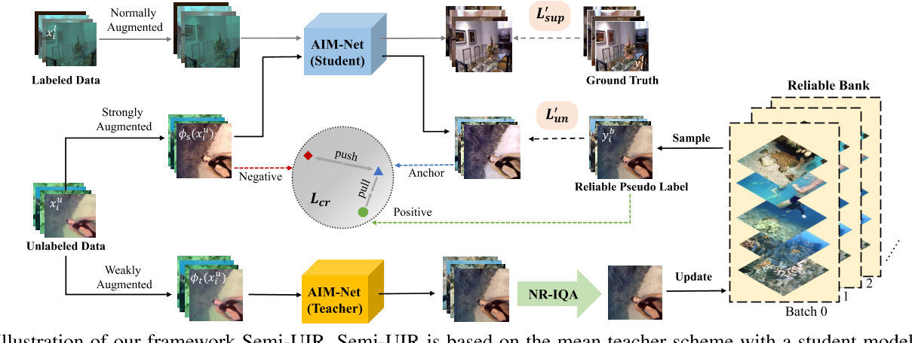

在ICCV/CVPR/WACV 23年的Main Conference发表论文列表以underwater和water为关键词搜索，可知这三个会议在23年有5篇水下相关的文章发表,

1. ICCV

- [WaterMask: Instance Segmentation for Underwater Imagery](https://openaccess.thecvf.com/content/ICCV2023/html/Lian_WaterMask_Instance_Segmentation_for_Underwater_Imagery_ICCV_2023_paper.html)（水下图像+分割）
- [Self-supervised Monocular Underwater Depth Recovery, Image Restoration, and a Real-sea Video Dataset](https://openaccess.thecvf.com/content/ICCV2023/html/Varghese_Self-supervised_Monocular_Underwater_Depth_Recovery_Image_Restoration_and_a_Real-sea_ICCV_2023_paper.html)（水下图像+场景深度估计+增强/恢复）
- [RFD-ECNet: Extreme Underwater Image Compression with Reference to Feature Dictionary](https://openaccess.thecvf.com/content/ICCV2023/html/Li_RFD-ECNet_Extreme_Underwater_Image_Compression_with_Reference_to_Feature_Dictionary_ICCV_2023_paper.html)（水下图像+图像压缩）

2. CVPR

- [Contrastive Semi-Supervised Learning for Underwater Image Restoration via Reliable Bank](https://openaccess.thecvf.com/content/CVPR2023/html/Huang_Contrastive_Semi-Supervised_Learning_for_Underwater_Image_Restoration_via_Reliable_Bank_CVPR_2023_paper.html)（水下图像+增强/恢复）
- [Indiscernible Object Counting in Underwater Scenes](https://openaccess.thecvf.com/content/CVPR2023/html/Sun_Indiscernible_Object_Counting_in_Underwater_Scenes_CVPR_2023_paper.html)（水下图像+目标识别）

3. WACV（无）

显然，单纯的水下图像增强只有一篇文章，而在水下图像的数据集上进行其他任务，例如场景深度估计、分割、目标识别等，相对更好发文章，接下来先读有增强部分的两篇，

## [CVPR23] Contrastive Semi-Supervised Learning for Underwater Image Restoration via Reliable Bank



文章在模型部分主要讲了三个东西，

- 学生教师网络

就是比较常见的学生教师网络模型，有一个学生网络，一个教师网络，学生网络通过与教师网络相关的信息更新，教师网络通过exponential moving average（EMA）更新，公式如下

$$
\theta_t = \eta\theta_t + (1-\eta)\theta_s
$$

其中$\theta_t$和$\theta_s$分别是学生和教师网络的权重，$\eta$是控制更新的超参

学生网络通过损失函数约束，优化器反向传播更新，公式如下
$$
L_{overall} = L_{sup} + \beta_1L_{per} + \beta_2L_{grad} + L_{un} + \gamma L_{cr}
$$
其实就是有监督的L1损失、感知损失、梯度损失加上无监督的教师损失和对比损失，分别对应接下来的两个部分，

- 可信赖银行

这篇文章所谓reliable bank的思路有些类似于之前看过的有的文章中的memory模块的思路，正常的教师学生网络应该是用教师网络的输出直接去约束学生网络的输出，其实就是两者作个L1损失，但是本文作者认为教师网络的输出有可能会有错误的地方，所以用了个bank把之前教师网络输出中最好的几张图存下来作为学生网络的参考

- 对比学习

经典的无监督学习方法，损失函数是个分数，分子部分是学生网络对无标签输入的输出和bank中伪标签的感知损失，分母部分是学生网络对无标签输入的输出和对应无标签输入的感知损失，其实就是让学生网络的输出和bank的记录更近，和原始输入更远

文章思路很简单，就是想办法把无标签的数据用上，学生教师网络只是个框架，bank和对比学习只是把无标签数据更好用上的方法。第一遍通读下来，有疑问的地方可能有两个，

- data augmentation

本文在大部分的输入前都作了个数据增强，并在ablation部分说明了数据增强的必要性，反应到代码中，有标签的数据只做了旋转，无标签的数据在数据读取的部分经过了如下函数，

```python
def data_aug(images):
    blurring_image = transforms.GaussianBlur()
    color_jitter = transforms.ColorJitter()
    strong_aug = images
    if random.random() < 0.8:
        strong_aug = color_jitter(strong_aug)
    strong_aug = transforms.RandomGrayscale(p=0.2)(strong_aug)
    if random.random() < 0.5:
        strong_aug = blurring_image(strong_aug)
    return strong_aug
```

- 训练步骤

本文没有详细介绍它的训练过程，但本文又有无标签数据又有有标签数据，又是学生教师两个网络，所以我认为还是需要明确一下训练步骤，在阅读代码后，我总结如下，bank在实际实现上就是把那些图存在了一个文件夹下面，

```python
for epoch in range(start, end):
    for (label_img, ...), (unlabel_img, ...) in dataloader:
		# teacher ouput
        O_t = model_t(unblabel_img)
        # student output
        O_s_l = model_s(label_img)
        O_s_ul = model_s(unlabel_img)
        
        # supervised loss
        loss = L1(O_s_l, img) + Lper(O_s_l, img) + Lgrad(O_s_l, img)
        
        # unsupervised loss
        p = get_bank(O_t) # update bank
        loss += L1(O_s_ul, p) + Lcontra(O_s_ul, p)
```

- Illumination Map

本文模型有两个输出，除了正常的水下图像外，还有个illumination map，但是本文美解释该图是如何生成的，只抛了个引用[55]Ye, Tian, et al. Underwater Light Field Retention : Neural Rendering for Underwater Imaging.我扫了一眼这篇文章以及代码，其实就是多次高斯模糊再过个log后和原本的图相加，

```python
def luminance_estimation(img):
    sigma_list = [15, 60, 90]
    img = np.uint8(np.array(img))
    illuminance = np.ones_like(img).astype(np.float32)
    for sigma in sigma_list:
        illuminance1 = np.log10(cv2.GaussianBlur(img, (0, 0), sigma) + 1e-8)
        illuminance1 = np.clip(illuminance1, 0, 255)
        illuminance = illuminance + illuminance1
    illuminance = illuminance / 3
    L = (illuminance - np.min(illuminance)) / (np.max(illuminance) - np.min(illuminance) + 1e-6)
    L = np.uint8(L * 255)
    return L
```

我的理解是在这样的计算下，所有的边缘和纹理信息都被模糊调了，剩下的就只有光照信息了

## [ICCV23] Self-supervised Monocular Underwater Depth Recovery, Image Restoration, and a Real-sea Video Dataset
