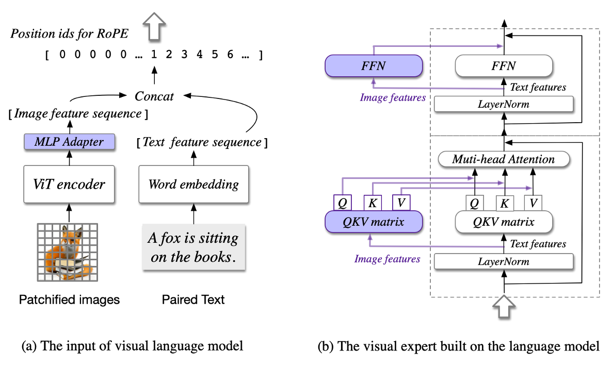

清华和智谱发表了CogVLM和CogAgent两篇文章，前者主要是提出了一个视觉大语言模型，后者对前者做了GUI任务的改进以及对高分辨率图像处理的改进，论文地址和代码地址如下，

- Paper
  - [CogVLM: Visual Expert for Pretrained Language Models](https://arxiv.org/abs/2311.03079)
  - [CogAgent: A Visual Language Model for GUI Agents](https://arxiv.org/abs/2312.08914)

- Code
  - [CogVLM](https://github.com/THUDM/CogVLM)

接下来先看CogVLM，

## [arXiv] CogVLM: Visual Experty for Pertrained Language Models

文章先讲了一个从**shallow alignment**到**deep fusion**的故事，前者我还需要再读一下对应的论文，我大概的理解是shallow alignment在固定基座模型参数的情况下，想办法把视觉能力加入，而这篇文章所谓的deep fusion改变了基座模型内部的处理过程和参数。

