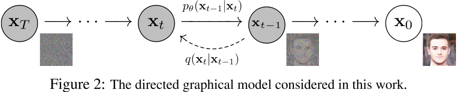
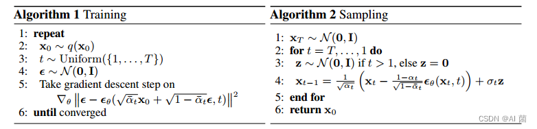
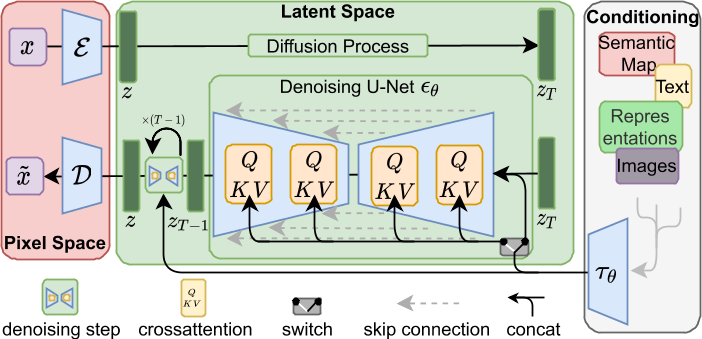

按照之前计划，打算读扩散模型相关的两篇文章，

- [Denoising Diffusion Probabilistic Models](https://arxiv.org/abs/2006.11239)（DDPM）
- [High-Resolution Image Synthesis with Latent Diffusion Models](https://arxiv.org/abs/2112.10752)（LDM）

结果读的时候发现这两篇文章，特别是前者，数学上的东西比较多，缺了一些基础知识，读起来有些困难，所以和之前不同，这次不求弄懂每一个公式是如何推导出来的的，目的是掌握每一个公式对应的物理含义，先来看Denoising Diffusion Probabilistic Models这篇文章，

## [NeurIPS] Denoising Diffusion Probabilistic Models

Diffusion Models作概念的介绍其实很简单，

- 在训练中，有一个真实图像$X_0$，对其逐步加噪，最终得到完全是噪声的$X_T$（DDPM将这个过程称为diffusion/forward process），此时训练一个去噪模型，使得该模型接受$X_{t}$和$t$作为输入，输出$X_{t-1}$

- 在推理中，从高斯分布中随机采样一个图片$X_T$，此时$X_T$就是一组噪声，通过t步的去噪操作，把$X_T$恢复成一个正常的图像$X_0$（DDPM将这个过程称为reverse process）

但是在实际操作上，DDPM这篇论文给出了下面两个算法，分别对应于训练过程和推理过程

训练过程输入一个真实图像$X_0$，一个随机采样的时间步t和一个从高斯分布中采样的噪声$\epsilon$，接下来它对关于这个噪声的一个损失作梯度下降，直到收敛。看到这里，即便不看任何公式，我们也可以发现，真实的训练过程和概念上的介绍有两点不同，

- DDPM并没训练一个去噪模型（输入有噪声的图像和对应的时间步，得到没有噪声的图像），而是想训练一个估计噪声的模型（输入有噪声的图像和对应的时间步，该时间步对应的噪声）
- 并没有对真实图像$X_0$逐步加噪的操作，而是一步到位，通过一个超参数$\bar\alpha_t$控制加入噪声的多少，$\bar\alpha_t$越大，则加入噪声越少

> 好了，训练过程到这里就讲完了，虽然DDPM作了这样那样的很多推导，但是落实到实际操作上，就是一个L2损失，标签是随机采样的噪声，模型是个U-Net，模型的输入是一张真实图像和一个数值t，然后训练这个模型到收敛。

前面这句话当然是开玩笑的，因为很多东西到这里还是无法解释，比如为什么用L2损失，各种超参是如何设置的，所以我们还是来看一下具体的数学原理，论文在Background一节首先对reverse process和diffusion process作了数学定义，这一部分讲得挺清除的，我们不做赘述，其中应该稍加关注的是这个式子，
$$
p_\theta(x_{t-1}|x_t) := N(x_{t-1};\mu_\theta(x_t,t),\Sigma_\theta(x_t, t))
$$
$\theta$是我们想要训练的那个噪声预测模型的参数，所以我们接下来的操作应该是找到一个目标函数，约束$\mu_\theta(x_t,t),\Sigma_\theta(x_t, t)$到对应的标签值。我们从最初的目标函数开始推起，对于任何一个生成的模型，最终的目标豆应该是使得，
$$
KL(p_{data}(x_0)||p_\theta(x_0)) \\
= -log\space p_\theta(x_0) \\
\leq D_{KL}(q(x_T|x_0)||p(x_T)) + \Sigma D_{KL}(q(x_{t-1}|x_t,x_0)|| p_\theta(x_{t-1}|x_t)) - log\space p_\theta(x_0|x_1)
$$
尽可能的小，即模型输出的分布和参考值分布之间尽可能接近（KL散度用来衡量两个分布的距离），而这个KL散度可以化做一个负对数似然，接下来文章经过一系列的推导找到了这个负对数似然的一个上界，所以最后的目标就变成了找到一个$\theta$使得这个上界足够小，显然这个上界有三个部分，其中第一个部分和$\theta$没有关系，不作考虑，重点来看第二个部分，
$$
\Sigma D_{KL}(q(x_{t-1}|x_t,x_0)|| p_\theta(x_{t-1}|x_t))
$$
其实就是$q(x_{t-1}|x_t,x_0)$和$p_\theta(x_{t-1}|x_t)$的距离，所以优化目标就是让这两个分布尽可能接近，后者我们在最前面讲过，是个高斯分布，前者经过一系列的推导，也可以解释为一个高斯分布，有，
$$
q(x_{t-1}|x_t,x_0) = N(x_{t-1};\breve\mu_t(x_t,x_0),\breve\beta_tI)
$$
其中，$\breve\mu_t(x_t,x_0)=\frac{\sqrt{\bar\alpha_{t-1}}\beta_t}{1-\bar\alpha_t}x_0+\frac{\sqrt{\alpha_t}(1-\bar\alpha_{t-1})}{1-\bar\alpha_t}x_t$，$\breve\beta_t=\frac{1-\bar\alpha_{t-1}}{1-\bar\alpha_t}\beta_t$，接下来文章做了一个工程性的操作，固定两个分布的方差，只比较它们的均值，于是我们就得到了一个损失函数，
$$
L_{t-1} = ||\breve\mu_t(x_t,x_0)-\mu_\theta(x_t,t)||^2
$$
接下来把这个损失函数展开，其中有$x_t = \sqrt{\bar\alpha_t}x_0+\sqrt{1-\bar\alpha_t}\epsilon$，$\epsilon$就是随机采样的噪声，有，
$$
L_{t-1} = ||\frac{1}{\sqrt{\alpha_t}}(x_t-\frac{\beta_t}{\sqrt{1-\bar\alpha_t}}\epsilon)-\mu_\theta(x_t,t)||^2
$$
此时不妨直接让，$\mu_\theta(x_t,t)=\frac{1}{\sqrt{\alpha_t}}(x_t-\frac{\beta_t}{\sqrt{1-\bar\alpha_t}}\epsilon_\theta)$，于是我们就同时得到了训练过程的损失函数和采样过程的递推式。最后我们还差一个东西没有处理，就是之前推出的上界中的$log\space p_\theta(x_0|x_1)$，但是大家看前面的算法可以发现，这一项被化成了和前面推出的损失函数一致的形式，使得$L_{t-1}$的t可以等于1，但是具体怎么到这一步的，我没看到。。。，还好这一小块应该不重要

##  [CVPR] High-Resolution Image Synthesis with Latent Diffusion Models

有了DDPM的基础，再来看LDM就简单多了，如上图所示，相比于DDPM，LDM主要做了三点改动，

- 噪声的求解模型从U-Net改成了Transformer
- 通过交叉注意力机制引入了各种条件来指导图像的生成
- 不是直接在像素级空间做扩散模型，而是在Latent空间做扩散模型

其实大概就是这几个点，这篇文章的重点不在它模型或者算法的设计上，因为主体内容和DDPM是一样，这篇文章的重点是它的结果，它取得了非常令人惊讶的结果，引领了一个时代的AICG的风潮

## 参考

1. [Denoising Diffusion Probabilistic Models (DDPM) - 馒头and花卷](https://www.cnblogs.com/MTandHJ/p/15698607.html)
2. [扩散模型 - Diffusion Model【李宏毅2023】](https://www.bilibili.com/video/BV14c411J7f2?p=1&vd_source=e7ac9aab3df6169a28cceb590ccf0b65)
