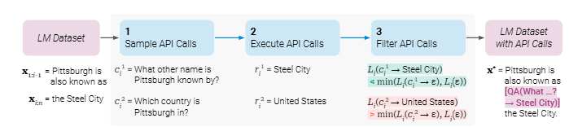
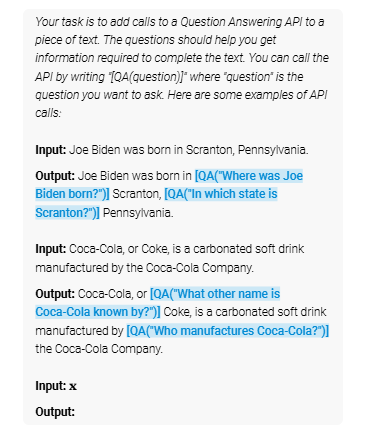
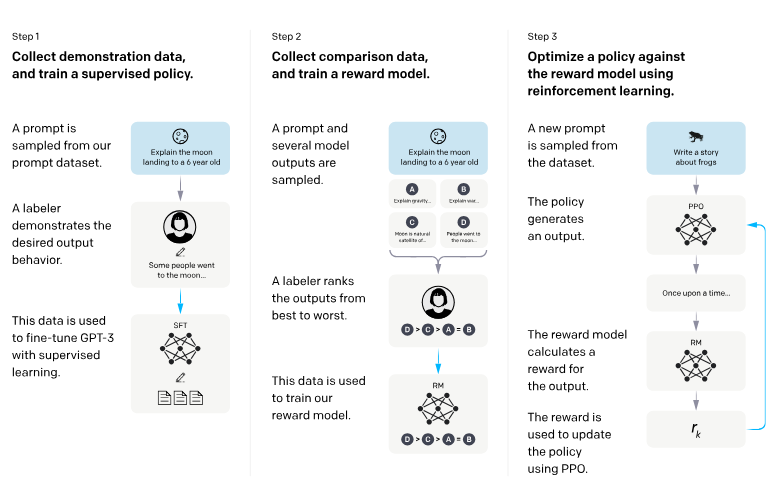

按照之前计划，读了三篇大语言模型相关的论文

- [Toolformer: Language Models Can Teach Themselves to Use Tools](https://arxiv.org/abs/2302.04761)
- [LLaMA: Open and Efficient Foundation Language Models](https://arxiv.org/abs/2302.13971)
- [Training language models to follow instructions with human feedback](https://arxiv.org/abs/2203.02155)（InstructGPT）

我们先来看Toolformer这篇文章，

## [arXiv] Toolformer: Language Models Can Teach Themselves to Use Tools

Toolformer的思路总结起来其实就一句话，用带Tool调用标记的数据集微调了一个LLM。当然其中还是有很多的技术细节，值得关注地方如下，

如上图所示，Toolformer的第一步是生成一个有API调用的数据集（LM Dataset -> LM Dataset with API Calls），上图只是一种宏观的视角，具体来说，第1步是通过还没微调的LLM的完成的，将LM Dataset的数据输入，要求LLM输出带有API Calls的输出，如下图所示，

有了API Calls，下一步就是执行，然后判断那个调用是有效的，将有效的留下。这个判断通过计算
$$
L_i^--L_i^+ \geq \alpha_f
$$
来实现，其中$L_i^-=min(L_i(\beta),L_i(e(c_i,\beta)))$，$L_i^+=L_i(e(c_i,r_i))$分别表示没有API调用或者仅接受API调用的输入时的损失，以及接受API调用和回复的损失，这个损失通过预测下一个词的概率的交叉熵损失表示，并乘以权重，使得更接近API调用处的权重更大。

有了数据集之后就微调，本文在这方面没有什么需要注意的。

## Training language models to follow instructions with human feedback

大名鼎鼎的InstructGPT论文，遵循了Open AI一贯的写作风格，不像论文反倒像篇技术报告，具体的技术了内容其实就只如上图所示，

- 人工标注数据集

他们通过人工标注了一批数据，对于某个问题希望大模型的回复。

- 奖励模型

但是只用人工标注花费太大，所以他们训练了个reward model，将大模型对于某个问题的回答输出多次，人工进行排序，将排序结果作为标签，训练一个reward model

- 通过奖励模型作强化学习

将LLM对于某个问题的输出输入奖励模型，并把奖励模型的输出作为大模型更新的约束

然后就是Open AI一贯的大批量的实验，这里不做赘述

## LLaMA: Open and Efficient Foundation Language Models

看完其实才知道LLaMA除了结果和开源外，在模型设计上其实没有什么特别需要关注的地方，文中说对模型架构有三点主要改进，

- Pre-normalization，在每个子层之前作RMSNorm
- SwiGLU激活函数，一个相比ReLU更好的激活函数，在负数区间处理更细节
- Rotary Embeddings，相对位置嵌入，可以更好的处理长输入
