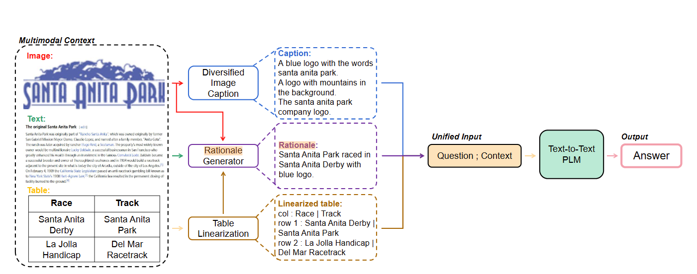
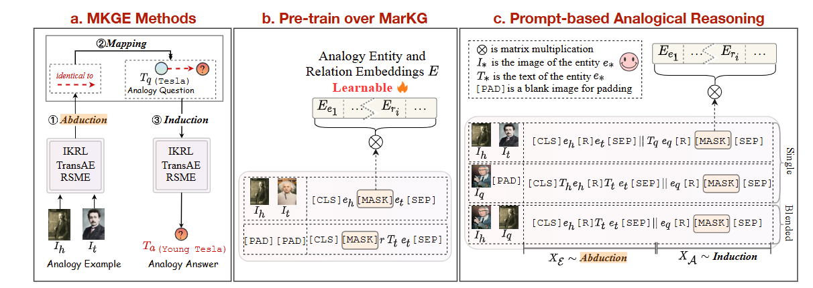
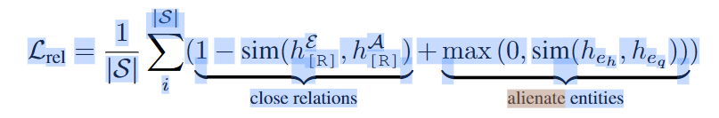
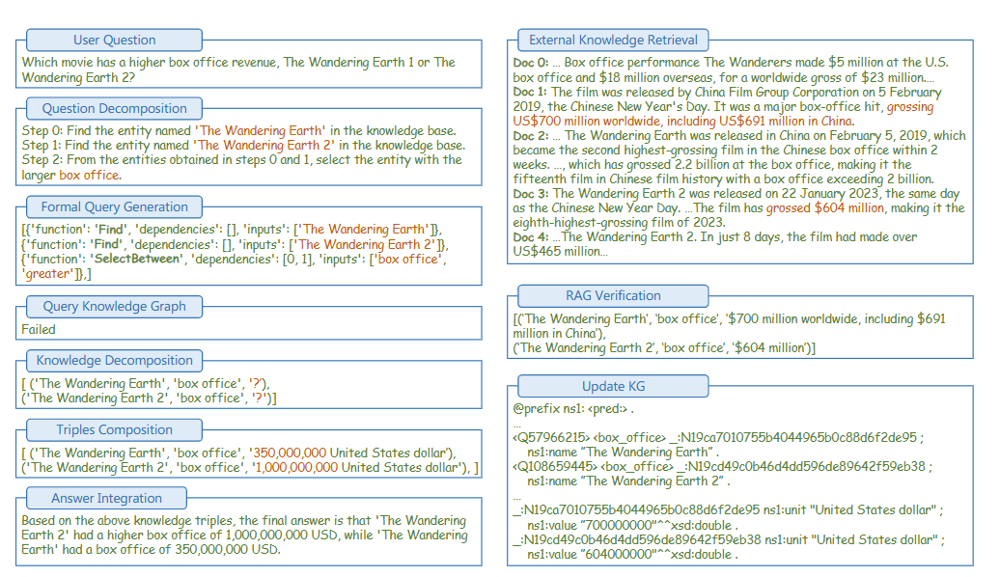
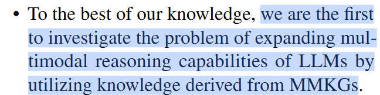

24年6月到8月，在考研结果尘埃落定后读了一些论文，主要涉及三个方面，首先是一些基础论文（Transformer/LLama/GPT等等），然后是CVPR，ICLR等会议24年的best paper，最后是多模态知识图谱和多模态QA方向的一些论文，这里主要对最后一个方面的论文写个总结。

| paper        | publication       | comment                             |
| ------------ | ----------------- | ----------------------------------- |
| ManyModalQA  | AAAI 20           | 三模态，模态选择（实际单模态）      |
| MultiModalQA | ICLR21            | 三模态，多跳                        |
| WebQA        | CVPR22            | 三模态，编码+拼接                   |
| MMCoQA       | ACL22             | 三模态，编码+模态选择（实际单模态） |
| Unified      | ACL findings 23   | 三模态，转文本                      |
| Unifying     | EMNLP findings 23 | 三模态，转文本                      |
| MarKG        | ICLR 23           | 知识图谱，多模态类比推理            |
| CogMG | arXiv 2406 | 知识图谱，LLM补全KG |
| MrKG | arXiv 2406 | 知识图谱，多模态QA |
| MMToM-QA     | ACL24             | 细分方向，反向贝叶斯规划            |
| EQA-MX       | ICLR24            | 细分方向，图片特征离散化 |
| CABINET      | ICLR24            | 细分方向，TableQA，Table注意力 |
| SnapNTell    | arXiv 2403        | 其他 |
| VISTA        | arXiv 2406        | 其他，多模态编码模型 |

## ManyModalQA / MultiModalQA / WebQA / MMCoQA

这几篇文章都是三模态的QA（图像，文本和表格），写作上很类似，都是说自己提出了一个数据集，然后构建了一个框架来处理这个数据集，由于都是两三年前的文章，他们的框架都很简单，具体来说，

- ManyModalQA


最早的一篇三模态QA的文章，方法也很简单，如上图所示，数据上自带上下文

- MultimodalQA


框架：先对问题分类，然后针对不同类型的问题，根据该问题相关的模态进行多跳的处理

数据：没有检索步骤，每对QA数据都自带相关的text，image或者table知识

- WebQA

框架：先编码，对于文本数据用Bert-base-cased tokenizer；对于图像数据，用目标检测模型（Faster RCNN）预测100个区域，把目标检测模型中间某一层的输出作为特征，然后<[CLS], si, [SEP], Q, [SEP]>判断si是不是有用的上下文，最后<[CLS], S, [SEP], Q,A, [SEP]>生成回答A

数据：两种设置，一种相关知识只有40个，一种包含全部知识库（900K）

- MMCoQA


框架：如上图所示，先编码，然后密集检索，然后生成答案


数据：不同的是这篇文章的数据集是对话式问答，每个问题只关于一个模态，也自带上下文

## Unified / Unifying Text, Tables, and Images 

两篇23年的三模态QA的文章，思路一样，都是把三种模态都转成文本后处理，




## MarKG / CogMG / MrKG

几篇关于知识图谱QA的文章

- MarKG

MarKG提出多模态类比推理任务，其实是一种特定的QA任务，他构建了一个数据集，包含一个多模态知识图谱，和一系列问答对，示例如下，

```json
{
    "example": ["Q14536140", "Q581459"], 
    "question": "Q50000", 
    "answer": "Q202875", 
    "relation": "P828", 
    "mode": 0
}
```

就是已知两个实体（特斯拉和青年特斯拉），这两个实体间有一个未知的关系（年轻），给定另一个实体（爱因斯坦），问知识图谱中和这个给给定实体具有未知关系的是那个实体（青年爱因斯坦）



提出了两条改进，

- Adaptive Interaction Across Analogy，对于注意力机制的注意力分数做一个带参数的掩码，控制example tokens和question-answer tokens间的交互
- Relation-Oriented Structure Mapping，类似于对比学习，一方面让example和answer的关系靠近，一方面让example和question的实体相互远离，公式如下



- CogMG

一篇Agent的文章，具体步骤如下，主要的点是做了知识图谱和大模型的交互（有LLM补全知识图谱）



- MrKG

他说自己是第一个做多模态知识图谱辅助LLM问答的



模型框架如下图，


## MMToM-QA / EQA-MX / CABINET

这几篇文章都是细分方向的QA，具体如下，

- MMToM-QA

心智理论（Theory of Mind）QA，我理解就是关于人类行为的问答，


方法有点传统方法符号主义的思路，Bayesian Inverse Planning Accelerated by Language Models（BIP-ALM），


写了一长串的公式，但是我看最后他的做法其实很简单，就是


先把每步的belief作为目标物体的可能位置，然后对LLM输入state st，goal g，估计的belief b和行为 at，计算该行为at的概率，遍历计算出上式，得到结果

- EQA-MX

Embodied QA，我理解就是对与输入图片中人的行为相关（或者说与环境相关）的问题作回答（例如图片中有个人指向了西红柿，问：这个东西是什么，应该回答：西红柿），模型总览图如下，


这篇文章方法上有意思的地方是他对图片数据做了个离散化，就是类似学一个词典的感觉，作者认为图片编码出的特征是连续的，不能直接和离散的文本特征融合，所以首先对图片特征做了离散化，其实就是预先学习了一个CodeBooks，在训练之后Codebook就固定住，后面测试的时候就通过图片的特征从这个CodeBooks里面找最相似的特征，作为离散的图片特征和文本特征拼在一起

- CABINET

思路很简单，Table QA任务中生成答案的时候并不需要所有Table cell的数据，只需要关注少部分的sub table，其他不需要关注的部分就是噪音，会影响QA的质量，所有通过一个相关分数使得LLM更关注需要关注的sub table，模型总览图如下，


生成相关分数有两个步骤，

- Unsupervised Relevance Scorer，用了给模型作无监督的相关分数评分，这里的无监督实际上通过聚类损失实现，就是把表中的每个元素分为相关和不相关两类
- Relevent Cell Predictor，训练了一个模型来根据输入的问题和表格预测需要关注的部分，这里是有监督的训练，然后通过生成的预测打出相应的相关分数

两个部分的相关分数加起来，然后和QA LLM的输入作乘法，相当于对不同的tokens施加注意力

## VISTA / SnapNTell

不好分类的两篇文章，

- VISTA，针对多模态检索的一个数据文本嵌入模型


他主要的点应该是提出了两个数据集，模型框架如上图，没什么特别好说的，


- SnapNTell，模型框架如下图


