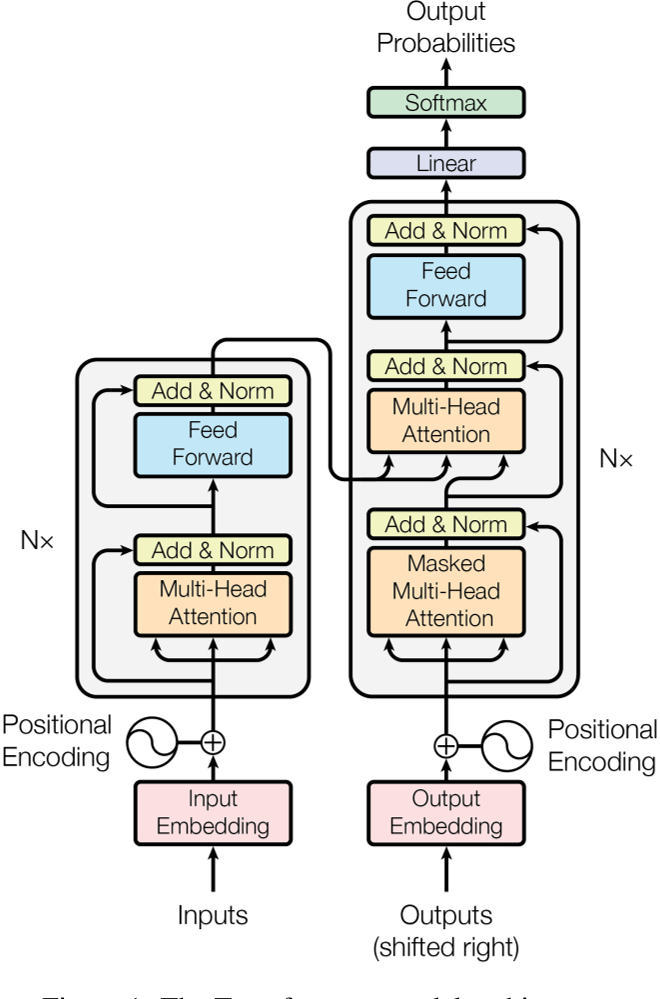

补下大模型的基础，读一下经典的大模型论文并作总结，包括下述几篇论文，在李沐老师PPT上偷了这张图，


- [Attention is all you need](https://arxiv.org/abs/1706.03762)（Transformer）
  
- [BERT: Pre-training of Deep Bidirectional Transformers for Language Understanding](https://arxiv.org/abs/1810.04805)（BERT）
  
- [Improving Language Understanding by Generative Pre-Training](https://s3-us-west-2.amazonaws.com/openai-assets/research-covers/language-unsupervised/language_understanding_paper.pdf)（GPT1）
  
- [Language Models are Unsupervised Multitask Learners](https://d4mucfpksywv.cloudfront.net/better-language-models/language_models_are_unsupervised_multitask_learners.pdf)（GPT2）
  
- [Language Models are Few-Shot Learners](https://arxiv.org/abs/2005.14165)（GPT3）
  

接下来先看Attention is all you need，也就是Transformer这篇文章，

## [NIPS] Attention is all you need



之前本科的时候很早就看过Tranformer相关的论文，总的算下来这是第三次通读这篇文章了，相比于前两次聚焦于文章的写作，模型的架构，代码的实现等等，这次多了一些感慨。正如作者在摘要中所说，Transformer是一个`simple `的网络，但正是这样一个简单的网络，简单的架构，作为一个起点，就像萨拉热窝的那颗子弹，掀起了令人难以置信的人工智能发展的浪潮。以至于我开始幻想，在我的有生之年真的可以看见，甚至参与到通用强人工智能的出现中来。好的，还是闲话少说，这里就不再详细过Transformer的模型了，主要是讨论几个我阅读过程中产生的疑惑，

- encoder-decoder结构

正如上图所言，Tansformer是一个典型的编码器解码器的结构，但是和计算机视觉中常见的encoder-decoder结构不同，计算机视觉中这类的结构通常伴随着数据维度的变化，在编码器端一般是通道数的增加以及特征图size的减小，解码器端则相反。可是Transformer整体过下来，它的每个block的输入和输出的大小一直是没有改变的，网上也没有找到相关的讨论或者解答，我个人认为，这两者的不同是因为任务的不同，Tansformer处理序列任务，序列的长度本身就带有一定的信息，所以保持不变的维度，一方面简化了模型的设计，另一方面可以更好的保留序列长度的信息。

当然，如果只讨论Transformer模型的设计，当然每个block的输入输出的维度不可以变化，我在前面讨论的意思主要是，为什么不设计CV的那种形式，同时肯定也伴随着一些其他设计的改变。

- Masked Multi-Head self-attention

每个文章的初读者大概都会对它这个掩码注意力的掩码部分产生疑惑，这其实主要是因为这篇文章的作者在写作的时候并没有想到文章会有如此大的影响力，它所计划面对的读者主要还是之前做过机器翻译，或者其他的序列任务的那群人，所以少阐述了一些基础知识。

Transformer在推理部分的伪代码应该是这样的，

```python
def inference(input, output_len):
    model = make_model()
    output = torch.ones(1)
    encoder_output = model.encoder(input, output)
   
	for i in range(output_len):
        tmp = model.decoder(input, output)
        output = torch.cat(output, tmp)
    
    return output
```

不是像常见的CV的模型那样，直接`output = model(input)`，而是一次一次的迭代，每次只预测下一个词，这就是所谓自回归auto-regressive。下一步来解释mask其实就很好理解了，在训练的时候，我其实知道想要的output是什么，所以模型输入的output就是lable，所以需要mask掉还没有推理出的部分，而测试的时候，模型是一个词一个词的预测的，这时候输入的output，就是之前时刻的输出加上padding把维度塞满。

## [arXiv] BERT: Pre-training of Deep Bidirectional Transformers for Language Understanding


## 总结

xxx

## 参考

- [The Annotated Transformer](https://nlp.seas.harvard.edu/annotated-transformer/#background)（对Transformer论文的注释和pytorch的代码实现）
- [Transformer论文逐段精读【论文精读】](https://www.bilibili.com/video/BV1pu411o7BE/?spm_id_from=333.788&vd_source=e7ac9aab3df6169a28cceb590ccf0b65)
- [BERT 论文逐段精读【论文精读】](https://www.bilibili.com/video/BV1PL411M7eQ/?spm_id_from=333.788&vd_source=e7ac9aab3df6169a28cceb590ccf0b65)

- [GPT，GPT-2，GPT-3 论文精读【论文精读】](https://www.bilibili.com/video/BV1AF411b7xQ/?spm_id_from=333.788&vd_source=e7ac9aab3df6169a28cceb590ccf0b65)
