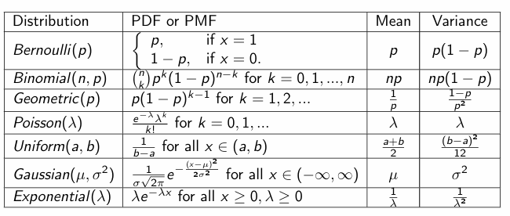

最近在看CS229 Machine Learning的课程，计划做下记录，本文是该课程的数学基础回顾的内容，对应第一周和第二周周末的TA课，主要是回顾了机器学习需要的线性代数和概率论的内容。

## 一 线性代数回顾

### 1）Basic Concepts and Notation

- 向量和矩阵长什么样
- 单位矩阵（The Indentity Matrix）和对角矩阵（Diagonal matrices)

### 2）Matrix Multiplication

- 向量间乘法
  - 内积（inner product/dot product）
  - 外积（outer product）
- 矩阵向量间乘法
- 矩阵乘法
  - 不同视角，其实就是按行和按列表示矩阵（我觉得没啥用）
  - 性质（结合律，分配律，不满足交换律）

### 3）Operations and Properties

- 矩阵的转置
  - 定义
  - 性质（$(A^T)^T=A^T$，$(AB)^T=B^TA^T$，$(A+B)^T=A^T+B^T$）
- 矩阵的迹（trace）
  - 定义（$trA=\sum^n_{i=1}a_{ii}$，就是对角元素和）
  - 性质（对于方阵，$trA=trA^T$,$tr(A+B)=trA+trB$，$tr(mA)=mtrA$，$trAB=trBA, if AB是方阵$）
- 向量的正则
  - 定义，a norm is any function：vectore->scaler，满足下面的性质，
    - 非负
    - definiteness（只有输入为0，输出才为0）
    - homogeneity（乘常数输入等于输出乘常数）
    - triangle inequality（$f(x+y) \leq f(x)+f(y)$）
  - 示例（$L_2\space norm: ||x||_2 = \sqrt{\sum^n_{i=1}x_i^2}$）
  - 矩阵的正则（$Frobenius\space norm:||A||_F=\sqrt(\sum^m_{i=1}\sum^n_{j=1}a_{ij}^2)=\sqrt{tr(A^TA)}$）
- 线性相关
  - 定义（一组向量线性相关，如果存在某个向量可以被其他向量线性表示，否则线性无关）
- 矩阵的秩
  - 定义（矩阵的极大线性无关集的行\列数）
  - 性质
    - $rank(A)\leq min(m,n)$，如果$rank(A)=min(m,n)$，则称A满秩
    - $rank(A)=rank(A^T)$
    - $rank(AB)\leq min(rank(A),rank(B))$
    - $rank(A+B)\leq rank(A)+rank(B)$
- 矩阵的逆（invertible=non-singular，non-invertible=singular）
  - 定义（$A^{-1}A=E=AA^{-1}$，只有满秩矩阵可逆）
  - 性质
    - $(A^{-1})^{-1}=A$
    - $(AB)^{-1}=B^{-1}A^{-1}$
    - $(A^{-1})^T=(A^T)^{-1}$
- 正交矩阵（Orthogonal Matrices）
  - 定义，如果一矩阵的所有列相互正交且正则，则该矩阵为正交矩阵
    - 两向量正交，则$x^Ty=0$
    - 向量正则，则$||x||_2=1$
  - 性质
    - 正交矩阵的逆等于他的转置
    - 正交阵乘向量不会改变向量的L2正则
- Span and 投影（projection）
  - span定义：一组向量的span就是所有能被这组向量线性表示的向量的集合
  - projection定义：向量y到某组向量span的投影就是这组向量中的v，且v和y的L2正则尽可能小
  - range定义：矩阵A的range（$R(A)$），就是A的列向量组的span
  - null space定义（$N(A)$），就是所有乘A为0的向量
- 行列式（The Determinant）
  - 定义，计算，直觉
  - 性质
    - $|E|=1$
    - 单行乘t，最后结果乘t
    - 交换两行，行列式取负
    - $|A|=|A^T|$，$|AB|=|A||B|$，$|A|=0$（当A is singular），$|A^{-1}|=1/|A|$
- 二次型（Quadratic Forms）
  - 定义：$x^TAx=\sum^n_{i=1}\sum^n_{j=1}A_{ij}x_ix_j$，通常假设A是对称的
  - 正定和半正定（positive\negative definite\semidefinite）
    - positive definite（PD），对任意的非零向量x，有$x^TAx>0$
    - positive semidefinite（PSD），对任意向量x，有$x^TAx\geq0$
    - negative definite（ND），negative semidifinite（NSD），indefinite
    - PD和ND的矩阵一定满秩
    - $G=A^TA$总是半正定，如果m>=n且A是满秩的，则G是正定的
- 特征值和特征向量（Eigenvalues and Eigenvectors）
  - 定义：$Ax=\lambda x, x\neq0$，其中x是特征向量，$\lambda$是特征值
  - 求解：$(\lambda E-A)x=0, x\neq0$，当$|\lambda E-A|=0$时，x有非零解
  - 性质
    - $trA=\sum^n_{i=1}\lambda_i$
    - $|A|=\prod^n_{i=1}\lambda_i$
    - A的秩等于A的非零特征值数
    - 对角阵的特征值是它对角线上的值，A的逆的特征值是A的特征值的倒数

  - 对称矩阵的特征值
    - A的特征值都是实数
    - 存在一组特征向量，他们相互正交

- 对角化
  - $A=AUU^T=U\bigwedge U^T$，对称矩阵的新表示，其中U的各列正交
  - 二次型对角化

### 4）Matrix Calculus

- 梯度（The Gradient）
  - $f(A)$的梯度等于f相对于每个位置上的$a_{ij}$求偏导的矩阵
  - 性质
    - $\nabla(f(x)+g(x)) = \nabla f(x)+ \nabla g(x)$
    - $\nabla (tf(x)) = t \nabla f(X)$
- Hessian（海森矩阵）
  - $(\nabla^2_xf(x))_{ij}= \frac{\partial^2f(x)}{\partial x_i\partial x_j}$
  - Hessian总是对称矩阵
- 梯度示例
  - 线性函数求梯度和二次型求梯度
  - 结论
    - $\nabla b^Tx=b$，$\nabla^2 b^Tx=0$
    - $\nabla x^TAx=2Ax$，$\nabla^2 x^TAx=2A$

## 二 概率论回顾

### 1）Basics

- Definitions，公理（Axioms）和推论（Corollaries）
  - 定义：采样空间，事件，概率
  - 公理
    - Axiom 1：$0\leq P(E)\leq1$
    - Axiom 2：$P(S)=1$
    - Axiom 3：$P(E)+P(F)=P(E\cup F)$
  - 推论
    - 补集的概率，E属于F的概率
    - Inclusion-Exclusion Principle：$P(E\cup F)=P(E)+P(F)-P(EF)$
- 条件概率和贝叶斯规则
  - 条件概率：$P(A|B)=\frac{P(A\cap B)}{P(B)}$
  - 全概率公式：$P(A)=\sum^n_{i=1}P(A|B_i)P(B_i)$
  - 贝叶斯公式：$P(B_k|A)=\frac{P(B_k)P(A|B_k)}{\sum^n_{i=1}P(A|B_i)P(B_i)}$
- 链式规则：$P(A_1\cap A_2...\cap A_n)=P(A_1)P(A_2|A_1)...P(A_n|A_{n-1}\cap...\cap A_1)$

- 独立性
  - 定义：$P(AB)=P(A)P(B)$
  - 性质
    - $P(A|B)=P(A)$
    - 可以推广到n个事件相互独立

### 2）Random Variables

- 随机变量：离散型随机变量和连续性随机变量
- Probaility Mass Function和Cumulative Distribution Function（概率分布函数）
  - PMF：$p_X(x)=P(X=x)$
  - CDF：$F_X(a)=P(X\leq a)$
    - 趋向无穷时是0，趋向负无穷时是1
    - 单调递增
    - $P(a\leq X\leq b)=F_X(b)-F_X(a)$

- Probability Density Function（概率密度函数）
  - 定义：$f_X(x)=\frac{dF_X(x)}{dx}$
  - 性质
    - 大于等于0，从负无穷到无穷的积分为1
    - $P(a\leq X\leq b)=\int^a_bf_X(x)dx$

### 3）Expectation-Variance

- Expectation（期望）
  - 离散随机变量：$\Epsilon[g(X)]=\sum_{x\in Val(X)}g(x)P_X(x)$
  - 连续随机变量：$\Epsilon[g(X)]=\int^\infty_{-\infty}g(x)f_X(x)$​
  - 性质
    - $Epsilon[a]=a$
    - $\Epsilon[af(X)]=a\Epsilon[f(X)]$
    - $\Epsilon[\Epsilon[X|Y]]=\Epsilon[X]$

- Variance（方差）
  - 定义：$Var(X)=\Epsilon[(X-\Epsilon[X]^2)]=\Epsilon[X^2]-\Epsilon[X]^2$
  - 性质
    - $Var[a]=0$
    - $Var[af(X)]=a^2Var[f(X)]$
- 常见概率分布的均值和方差

### 4）Joint Distributions

- 离散变量的联合分布和边缘分布
  - Joint PMF：$p_{XY}(x,y)=P(X=x,Y=y)$
  - Marginal PMF：$p_X(x)=\sum_xP_{XY}(x,y)$
- 连续变量的联合分布和边缘分布
  - Joint PDF：$f_{XY}(x,y)=\frac{\delta^2F_{XY}(x,y)}{\delta x \delta y}$
  - Marginal PDF：$f_X(x)=\int^{\infty}_{-\infty}f_{XY}(x,y)dy$
- 多变量的形式
- 多随机变量的均值
  - 离散变量：$E[g(X,Y)]=\sum_{x\in Val(x)}\sum_{y\in Val(y)}g(x,y)p_{XY}(x,y)$
  - 连续变量：$E[g(X,Y)]=\int^{\infty}_{-\infty}\int^{\infty}_{-\infty}g(x,y)f_{XY}(x,y)dxdy$
  - 可以扩展到多变量的形式

### 5）Covariance（协方差）

- Covariance
  - 定义：$Cov[X,Y]=E[(X-E[X])(Y-E[Y])]=E[XY]-E[X]E[Y]$
  - 性质
    - 如果$Cov[X,Y]<0$，则X和Y负相关；大于0，则正相关；等于0，则不相关
    - 独立一定不相关，因为独立有$E[XY]=E[X]E[Y]$
    - 不相关不一定独立
    - $Var[X+Y]=Var[X]+Var[Y]+2Cov[X,Y]$
    - $Cov[X,X]=Var[X]$

### 6）RV Conditional

- 离散变量的条件分布：$p_{Y|X}(y|x)=\frac{p_{XY}(x,y)}{p_X(x)}$
- 连续变量的条件分布：$f_{Y|X}(y|x)=\frac{f_{XY}(x,y)}{f_X(x)}$
- 贝叶斯公式和链式法则
- 独立性：$F_{XY}(x,y)=F_X(x)F_Y(y)$

### 7）Random Vectors

- 就把随机变量列成一个矩阵
- Covariance matrix：$\sum = E[(X-E[X])(X-E[X])^T]$

### 8）Multivariate Gaussian

- 多变量高斯分布
