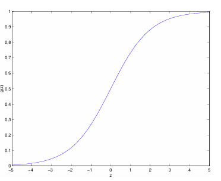
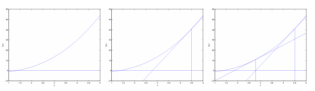

最近在看CS229 Machine Learning的课程，计划做下记录，本文是该课程第一周和第二周的内容（第一节导论课除外），主要包括

- Linear Regression
- Classification 和 Logistic Regression
- Generalized Linear Models

## 一 Linear Regression

线性回归算法（或者说Least Mean Squares回顾模型）的引入其实很自然，作者用一个房价预测的例子构建了下面的**线性回归模型**，

$$h_\theta (x) = \theta_0+\theta_1 x_1 + ... + \theta_n x_n$$

函数的输入是房价相关的特征（面积，卧室数等），输出是预测的房价。下面的问题就变成了**如何找到$\theta$**，作者就抛出了一个最小二乘损失函数，

$$J(\theta)=\frac{1}{2}\sum_{i=1}^n(h_\theta (x^{i})-y^{i})^2$$

所以问题又变成找到最小二乘损失函数最小时的$\theta$，也就引入了**梯度下降算法**；然后解释了如何推出该损失函数，也就是**线性回归模型的概率视角**。

本章的重点有，

- 线性回归模型
- 最小二乘损失函数的概率视角
- 梯度下降算法

## 二 Classification 

这部分是从二分类问题引入的，也就是有对任意的输入，输出应该为{1，0}，然后皆介绍了**logistic regression**，就是在上面的线性回归的基础上，加上了logistic/sigmoid函数，

$$h_\theta (x) = \frac{1}{1+e^{-\theta^Tx}}$$

logistic函数的图像如下图，

然后就是类似的概率视角，来推出我们现在常见的**二分类交叉熵损失函数**。首先假设模型的输出应该就是y分类为1或0的概率，所以y服从参数为$h_\theta (x)$的二项分布，也就有，

$$p(y|x;\theta)=(h_\theta(x))^y(1-h_\theta(x))^{1-y}$$

然后取log，最后可以得到下式，

$$J(\theta)=\sum^n_{i=1}y^ilogh(x^i)+(1-y^i)log(1-h(x^i))$$

然后就可以通过类似的梯度下降算法求解$\theta$。最后这章介绍了**牛顿方法（Newton‘s method）**来求解$\theta$，与随机梯度下降的$\theta_j = \theta_j+\alpha \frac{\partial J(\theta)}{\partial \theta_j}$不同，牛顿法遵循$\theta=\theta-\frac{J'(\theta)}{J''(\theta)}$，直观的理解如下图，牛顿法不是求最小大值，它是求函数的根，所以牛顿法针对的是损失函数的导数，但是牛顿法要求二阶导，所以计算复杂度更高。

本章的重点有，

- Logistic回归
- 二分类的交叉熵损失函数
- 牛顿方法

## 三 Generalized Linear Models

本章首先抛出了**exponential family distributions**的定义，

$$p(y;\eta)=b(y)exp(\eta^TT(y)-a(\eta))$$

然后证明了正态分布和二项分布都是expoential family（当然还有很多其他分布）。然后构建了**GLM（标准线性模型）**，其输入、输出和模型参数满足

1. 输出y服从exponential family分布
2. 给定x，目标是预测y，其实是求$h(x)=E[y|x]$
3. $\eta=\theta^Tx$

然后介绍了多分类任务的**Softmax regression**，有

$$h_\theta(x)=\frac{exp(\theta_i^Tx)}{\sum_{j=1}^kexp(\theta_j^Tx)}$$

损失函数的推导也和前面两个类似。

本章的重点有，

- exponential family distributions
- Generalized Linear Models
- Softmax regression
