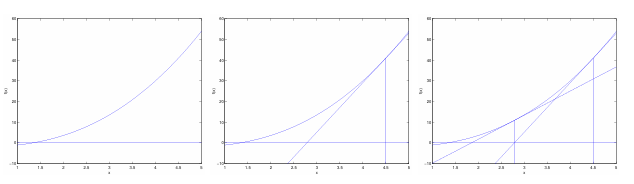

最近在看CS229 Machine Learning的课程，计划做下记录，本文是该课程第三周和第四周的内容，主要包括

- Generative Learning algorithms
- Kernel methods
- Neural Network 1

## 一 Generative Learning algorithms

课程首先介绍了生成学习算法和判别学习算法

- **discriminative learning algorithms**（判别学习算法），尝试直接学习$p(y|x)$，之前学习的Linear regression、Logistic regression和softmax regression都属于此类
- **generative learning algorithms**（生成学习算法），通过估计$p(y)$和$p(x|y)$利用贝叶斯规则计算$p(y|x)$

然后具体介绍了两种生成学习算法，

- **Gaussian discriminant analysis（GDA）**

对于二分类问题，首先假设y服从伯努利分布，x|y=0和x|y=1服从均值不同，方差一致的多变量正态分布，然后还是和之前一样，构建概率的损失函数，找到对应的参数，使得训练数据的概率最大，只是这里的x，y联合分布，也可以分解为$p(y)p(x|y)$，然后可以计算出几个参数对应的数值

- **Naive Bays**

朴素贝叶斯算法的核心是朴素贝叶斯假设（NB assumption），其实就是对于输入的多维向量x，假设每个位置上的$x_i$都条件独立于给定的y，然后就有，

最后和之前一样，构建一个损失函数，

然后本节还介绍了Laplace smoothing，其实就是如果数据中存在某个未出现的值，按前面算法计算出的参数会有问题，所以计算的时候在分子和分母的部分分别加上对应的数值

## 二 Kernel methods

这部分是从二分类问题引入的，也就是有对任意的输入，输出应该为{1，0}，然后皆介绍了**logistic regression**，就是在上面的线性回归的基础上，加加上了logistic/sigmoid函数，

$$h_\theta (x) = \frac{1}{1+e^{-\theta^Tx}}$$

logistic函数的图像如下图，

然后就是类似的概率视角，来推出我们现在常见的**二分类交叉熵损失函数**。首先假设模型的输出应该就是y分类为1或0的概率，所以y服从参数为$h_\theta (x)$的二项分布，也就有，

$$p(y|x;\theta)=(h_\theta(x))^y(1-h_\theta(x))^{1-y}$$

然后取log，最后可以得到下式，

$$J(\theta)=\sum^n_{i=1}y^ilogh(x^i)+(1-y^i)log(1-h(x^i))$$

然后就可以通过类似的梯度下降算法求解$\theta$。最后这章介绍了**牛顿方法（Newton‘s method）**来求解$\theta$，与随机梯度下降的$\theta_j = \theta_j+\alpha \frac{\partial J(\theta)}{\partial \theta_j}$不同，牛顿法遵循$\theta=\theta-\frac{J'(\theta)}{J''(\theta)}$，直观的理解如下图，所以牛顿法不是求最小大值，它是求函数的根，所以牛顿法针对的是损失函数的导数，但是牛顿法要求二阶导，所以计算复杂度更高。

本章的重点有，

- Logistic回归
- 二分类的交叉熵损失函数
- 牛顿方法

## 三 Neural Network 1

本章首先抛出了**exponential family distributions**的定义，

$$p(y;\eta)=b(y)exp(\eta^TT(y)-a(\eta))$$

然后证明了正态分布和二项分布都是expoential family（当然还有很多其他分布）。然后构建了**GLM（标准线性模型）**，其输入、输出和模型参数满足

1. 输出y服从exponential family分布
2. 给定x，目标是预测y，其实是求$h(x)=E[y|x]$
3. $\eta=\theta^Tx$

然后介绍了多分类任务的**Softmax regression**，有

$$h_\theta(x)=\frac{exp(\theta_i^Tx)}{\sum_{j=1}^kexp(\theta_j^Tx)}$$

损失函数的推到也和前面两个类似。

本章的重点有，

- exponential family distributions
- Generalized Linear Models
- Softmax regression
