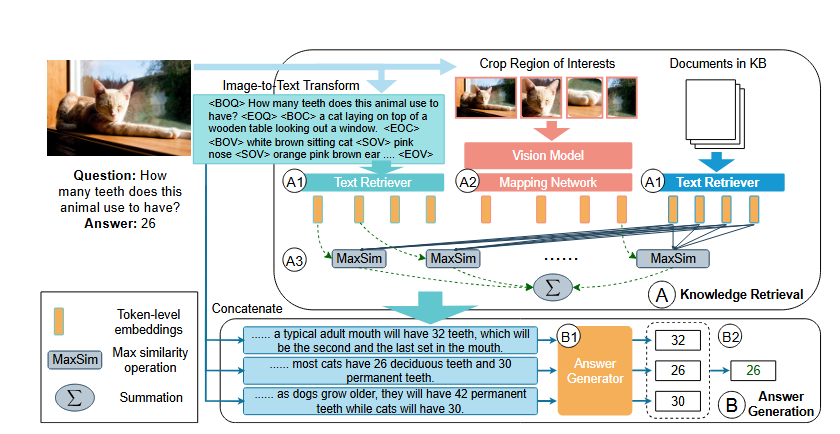
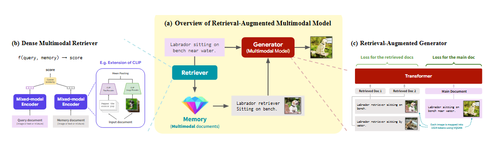
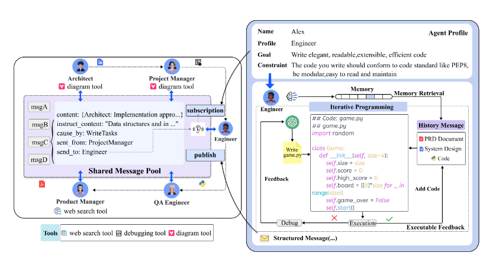
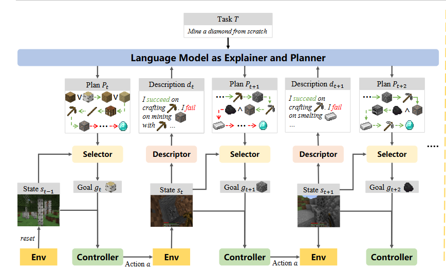

6月2日晚20时45分，来作个5月份学习的总结以及做6月份的规划，5月的总结分成两个部分，

- 论文阅读，看的论文的总结和评价
- 学习总结，专业课程或者其他方面的学习总结

### 一 论文阅读

5月总共读了**11**篇论文，首先读了Transformer，BERT和GPT123 五篇文章，写博客作了总结，

- [Attention is all you need ](https://arxiv.org/abs/1706.03762)（Transformer）

- [BERT: Pre-training of Deep Bidirectional Transformers for Language Understanding ](https://arxiv.org/abs/1810.04805)（BERT）
- [Improving Language Understanding by Generative Pre-Training ](https://s3-us-west-2.amazonaws.com/openai-assets/research-covers/language-unsupervised/language_understanding_paper.pdf)（GPT1）
- [Language Models are Unsupervised Multitask Learners ](https://d4mucfpksywv.cloudfront.net/better-language-models/language_models_are_unsupervised_multitask_learners.pdf)（GPT2）
- [Language Models are Few-Shot Learners ](https://arxiv.org/abs/2005.14165)（GPT3）

然后读了扩散模型相关的两篇文章，也写了博客总结，

- [Denoising Diffusion Probabilistic Models ](https://arxiv.org/abs/2006.11239)（DDPM）
- [High-Resolution Image Synthesis with Latent Diffusion Models ](https://arxiv.org/abs/2112.10752)（LDM）

还读了RAG相关的两篇文章，

- [Fine-grained Late-interaction Multi-modal Retrieval for Retrieval Augmented Visual Question Answering](https://arxiv.org/abs/2309.17133)

- [Retrieval-Augmented Multimodal Language Modeling ](https://arxiv.org/abs/2211.12561)

读了大模型Agent相关的两篇文章，

- [MetaGPT: Meta Programming for A Multi-Agent Collaborative Framework](https://arxiv.org/abs/2308.00352)

- [Describe, Explain, Plan and Select: Interactive Planning with Large Language Models Enables Open-World Multi-Task Agents ](https://arxiv.org/abs/2302.01560)

### 二 学习总结

5月原开展了2个方面的学习

- 数学分析

《数学分析新讲》看完了第2章，但是还没有作总结和习题，6月应重点完成该项学习

- 《CSAPP》

看完了第3章，完成了总结和两个lab，有一定收获，特别时锻炼了gdb的使用，复习了汇编语言

### 三 6月规划

首先是论文阅读的计划，6月计划先读一下几个方面的文章 

- InstructGPT、llama、Toolformer三篇

- VIT和视觉大预言模型相关文章

主要从李沐的精读论文系列中找要读的文章。

然后是学习上的规划，

- 数学分析，计划把《数学分析新讲》第一本书看完
- 《CSAPP》至少看完第四章
- 《中国通史》计划每天晚上睡前看看

还有作息，6月不能再颓废下去了

