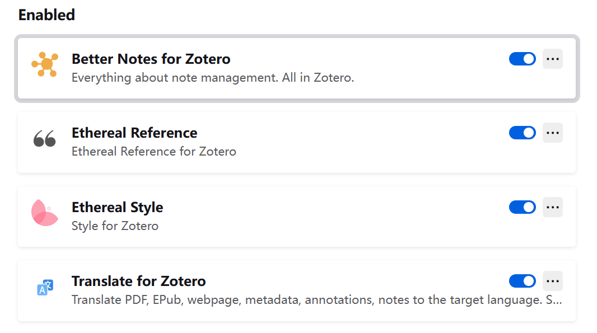
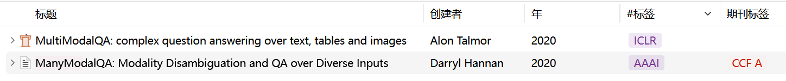

最近刚放寒假，我计划把论文阅读的工具换成zotero，因为有时候用readpaper有点卡，而且他没有内置的笔记（只有注释），同时正好能整理一下去年读过的有意思的论文。首先理一下用zotero，我需要它达成什么功能，对应需要什么插件，

- 基础的论文阅读功能
  - 文本高亮、注释、勾勾画画之类的，Zotero原生就可以解决
  - 划词翻译：Translate for Zotero插件
  - 参考文献的便捷显示：Zotero Reference 插件
- 论文条目展示页面显示漂亮一点：Ethereal Style插件
- 每篇论文对应的一篇笔记，最好支持Markdown：Better Notes插件
- 写论文的时候需要导出引用
- 最好能有同步服务（~~环境~~和论文），回所后所里的电脑也能直接看

## 软件操作

### 1 导出引用

有两种方式，

- 导出文本引用：按住`Shift`选择要导出的论文，然后右键`用所选条目创建参考文献表`
- 导出.bib：右键文件夹，导出分类，选择BibTex格式

### 2 同步

> 没找到环境同步的功能或者插件

由于Zotero自带的空间好像有点小，我决定使用坚果云完成同步，按照Zotero 中文社区的：[数据与文件的同步](https://zotero-chinese.com/user-guide/sync)逐步操作即可。

## 插件配置

> 我主要使用了下面的插件，
>
> 

### 1 Translate for Zotero 插件

- Github仓库：[windingwind/zotero-pdf-translate](https://github.com/windingwind/zotero-pdf-translate?tab=readme-ov-file)

- 手册：[Zotero PDF Translate手册](https://github.com/windingwind/zotero-pdf-translate?tab=readme-ov-file)

直接Github下载，然后添加到Zotero中，因为一方面我有梯子所以可以直接用Google的不需要密钥的翻译服务，另一方面，我没有整个pdf一下翻译的需求，只是遇到不懂的单词或者句子的时候需要翻译一下，所以只用到了最基础的功能，几乎是开箱即用。感觉没有什么需要配置或者注意的地方。

### 2 Zotero Reference 插件

- Github仓库：[[MuiseDestiny/zotero-reference](https://github.com/windingwind/zotero-pdf-translate?tab=readme-ov-file)

配置没什么好说的，但是感觉用处不大，只是有时候可能可以看一眼参考文献大概的样子

### 3 Ethereal Style 插件

- Github仓库：[MuiseDestiny/zotero-style](https://github.com/MuiseDestiny/zotero-style)

- 手册：[Ethereal Style 中文文档](https://www.notion.so/Zotero-Style-bc2aebbbb6df4b7baa858e376e4fc5be)

也是一样Github下载，但是设置要更复杂一点，我主要设置了以下几个方面，

1. 应该显示那些列，下图是我的设置

2. 期刊标签的显示，按手册配置[easyScholar](https://www.easyscholar.cc/)，值得注意的是，如果需要使用ccf评级，应该在自建数据集中选择ccf数据集
3. 我还希望显示期刊名称，通过`#标签`实现

遇到了一个问题，

1. 期刊标签的配置中，CCF应该大写（或者说，在右键论文条目，选择更新期刊标签后，应该根据跟新的显示，填写Field参数）

### 4 Better Notes 插件

- Github仓库：[windingwind/zotero-better-notes](https://github.com/MuiseDestiny/zotero-style)

- 手册：[Better Notes手册](https://github.com/windingwind/zotero-better-notes?tab=readme-ov-file#-quick-start)

也是直接下载按照，配置没啥好说的，感觉除了支持markdown，还有点像Notion，可以通过斜杠做一些操作，以及支持不同的连接之类的，但是我一般也用不上，我应该在zotero内只会针对每篇论文写读书笔记。

然后我用它的模板功能创建了一个论文的读书模板，直接参考的这篇模板：[[Item\] PaperNote 适配Zotero 6 7 中英文文献 自用SCI笔记模版](https://github.com/windingwind/zotero-better-notes/discussions/771#discussioncomment-7432015)，在他的基础上做了些简单的修改

